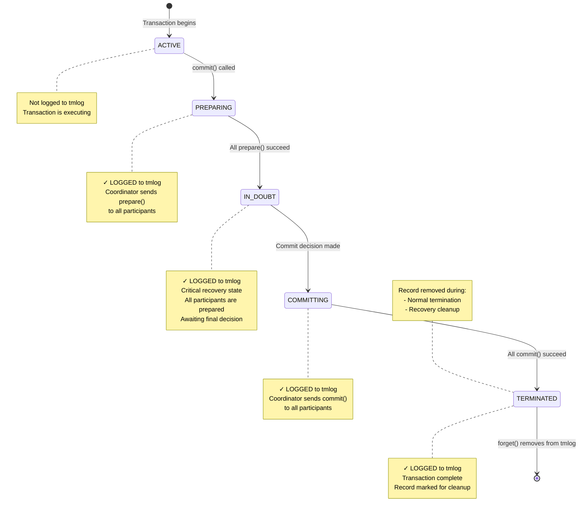
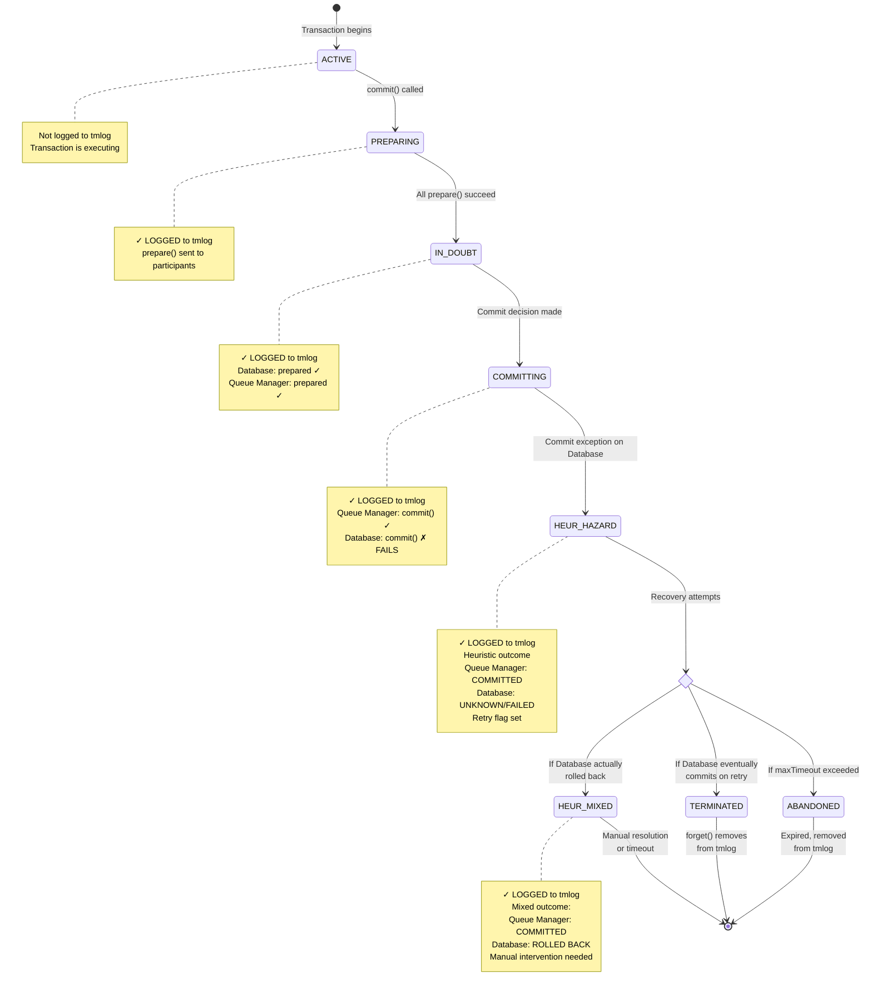

# Atomikos Transaction Log (tmlog) Research

This document provides a comprehensive analysis of how Atomikos uses its transaction log (tmlog) file, including transaction states, transitions, and behavior in various scenarios.

## Table of Contents
- [Overview](#overview)
- [When Transactions are Stored to tmlog](#when-transactions-are-stored-to-tmlog)
- [When Transactions are Removed from tmlog](#when-transactions-are-removed-from-tmlog)
- [Transaction States](#transaction-states)
- [Scenario 1: Successful Transaction](#scenario-1-successful-transaction)
- [Scenario 2: Commit Failure After Prepare Success](#scenario-2-commit-failure-after-prepare-success)
- [Critical Question: Rollback After Prepare Success?](#critical-question-rollback-after-prepare-success)

---

## Overview

Atomikos uses a transaction log file (tmlog) to ensure ACID properties and enable recovery in case of system failures. The log follows the Two-Phase Commit (2PC) protocol and records transactions in **recoverable states** to ensure proper recovery.

### Key Components

- **StateRecoveryManagerImp**: Listens to FSM (Finite State Machine) state transitions and triggers logging
- **OltpLogImp**: Validates and persists transaction records to the repository
- **RecoveryLogImp**: Manages recovery operations and cleanup
- **RecoveryDomainService**: Performs periodic recovery scans for expired transactions

---

## When Transactions are Stored to tmlog

Transactions are written to the tmlog when they enter **recoverable states**. This happens through the following process:

1. **Trigger**: When a transaction coordinator transitions to a recoverable state
2. **States that trigger logging**:
   - `PREPARING` - Prepare phase in progress
   - `IN_DOUBT` - Waiting for commit/abort decision (most critical for recovery)
   - `COMMITTING` - Commit phase in progress
   - `ABORTING` - Rollback phase in progress
   - `HEUR_COMMITTED` - Heuristically committed
   - `HEUR_ABORTED` - Heuristically rolled back
   - `HEUR_MIXED` - Mixed outcome across participants
   - `HEUR_HAZARD` - Uncertain outcome

3. **Process Flow**:
   ```
   Coordinator enters recoverable state
   → StateRecoveryManagerImp.preEnter() is called
   → PendingTransactionRecord is created from coordinator state
   → OltpLogImp.write() persists the record to repository
   ```

4. **Non-recoverable states** (NOT logged):
   - `ACTIVE` - Transaction is running (not yet prepared)
   - `MARKED_ABORT` - Rollback-only flag set
   - `COMMITTED` - Successfully committed (terminal state, no recovery needed)
   - `ABORTED` - Rolled back (terminal state, no recovery needed)
   - `ABANDONED` - Timed out without resolution

**Implementation References**:
- `StateRecoveryManagerImp.java` (lines 34-51)
- `OltpLogImp.java` (line 48) - Validates recoverable states

---

## When Transactions are Removed from tmlog

Transactions are removed or marked as terminated in two scenarios:

### Scenario A: Normal Termination

When a transaction completes (successfully or with failure):

1. **Trigger**: Transaction reaches a final state
2. **Process**:
   ```
   RecoveryLogImp.forget(coordinatorId) is called
   → Record is marked as TERMINATED state
   → Record is updated in repository (state change, not deletion)
   ```

**Implementation Reference**: `RecoveryLogImp.java` (lines 98-102)

### Scenario B: Recovery Cleanup

During periodic recovery scans:

1. **Expired COMMITTING transactions**: Automatically forgotten after timeout
2. **Expired IN_DOUBT transactions**: Forgotten if beyond `maxTimeout`
3. **Foreign IN_DOUBT coordinators**: Forgotten for heuristic abort scenarios
4. **Process**:
   ```
   RecoveryDomainService performs periodic scans
   → Identifies expired transactions
   → Calls RecoveryLogImp.forgetTransactionRecords()
   → Removes all expired records from repository
   ```

**Implementation References**:
- `RecoveryLogImp.java` (lines 75-83)
- `RecoveryDomainService.java` (recovery logic)

---

## Transaction States

Atomikos defines transaction states in the `TxState` enum:

### Operational States (OLTP)
- **ACTIVE**: Transaction is running, no logging
- **MARKED_ABORT**: Rollback-only flag set
- **LOCALLY_DONE**: Preparation/termination phase
- **COMMITTED**: Successfully committed (terminal)
- **ABORTED**: Rolled back (terminal)
- **ABANDONED**: Timed out without resolution

### Recoverable States (Logged to tmlog)
- **PREPARING**: Prepare phase in progress
- **IN_DOUBT**: Waiting for commit/abort decision (critical!)
- **COMMITTING**: Commit phase in progress
- **ABORTING**: Rollback phase in progress

### Heuristic/Final States
- **HEUR_COMMITTED**: Heuristically committed
- **HEUR_ABORTED**: Heuristically rolled back
- **HEUR_MIXED**: Mixed outcome (some resources committed, others rolled back)
- **HEUR_HAZARD**: Uncertain outcome (need manual intervention)
- **TERMINATED**: Final cleanup marker

### State Transition Rules

From `TxState.java`, these transitions are enforced:

- **ACTIVE** → PREPARING, COMMITTING, ABORTING
- **PREPARING** → IN_DOUBT, ABORTING, TERMINATED, ABANDONED
- **IN_DOUBT** → ABORTING, COMMITTING, ABANDONED, TERMINATED
- **COMMITTING** → HEUR_ABORTED, HEUR_COMMITTED, HEUR_HAZARD, HEUR_MIXED, TERMINATED, ABANDONED
- **ABORTING** → HEUR_ABORTED, HEUR_COMMITTED, HEUR_HAZARD, HEUR_MIXED, TERMINATED, ABANDONED

---

## Scenario 1: Successful Transaction

This diagram shows a typical successful 2PC transaction with two participants (e.g., Database and Queue Manager).



### Detailed Flow for Successful Transaction:

1. **ACTIVE** (not logged): Transaction starts, application executes business logic
2. **PREPARING** (logged): 
   - Transaction manager calls `prepare()` on Database participant → Vote: YES
   - Transaction manager calls `prepare()` on Queue Manager participant → Vote: YES
3. **IN_DOUBT** (logged): 
   - All participants voted YES
   - Coordinator makes COMMIT decision
   - Critical state: if crash occurs here, recovery will commit
4. **COMMITTING** (logged):
   - Coordinator calls `commit()` on Database → SUCCESS
   - Coordinator calls `commit()` on Queue Manager → SUCCESS
5. **TERMINATED** (logged):
   - All resources committed successfully
   - Record marked as TERMINATED
6. **Removed from tmlog**: `forget()` is called, record is removed

---

## Scenario 2: Commit Failure After Prepare Success

This diagram shows what happens when prepare succeeds on all participants, but commit fails on one resource (Database) after succeeding on another (Queue Manager).



### Detailed Flow for Failed Commit Scenario:

1. **ACTIVE** (not logged): Transaction starts normally
2. **PREPARING** (logged):
   - `prepare()` on Database → Vote: YES ✓
   - `prepare()` on Queue Manager → Vote: YES ✓
3. **IN_DOUBT** (logged):
   - All participants prepared successfully
   - Coordinator makes COMMIT decision (cannot be changed!)
4. **COMMITTING** (logged):
   - `commit()` on Queue Manager → SUCCESS ✓
   - `commit()` on Database → **EXCEPTION** ✗
   - Exception wrapped as `HeurHazardException` (CommitMessage.java, lines 54-67)
5. **HEUR_HAZARD** (logged):
   - Transaction enters heuristic hazard state
   - Queue Manager has committed (cannot be undone)
   - Database outcome is unknown
   - Retry flag is set for recovery attempts
6. **Recovery Attempts**:
   - Recovery service periodically scans for expired COMMITTING/HEUR_HAZARD transactions
   - Attempts to retry commit on Database
   - Three possible outcomes:
     - **Success** → TERMINATED (Database eventually commits)
     - **Permanent Failure** → HEUR_MIXED (Database rolled back, Queue Manager committed)
     - **Timeout** → ABANDONED (maxTimeout exceeded, needs manual intervention)

---

## Critical Question: Rollback After Prepare Success?

### ❌ NO - Atomikos Will NOT Send a Rollback

**Question**: In the scenario where prepare succeeds but commit fails on the database (after succeeding on queue manager), will Atomikos send a rollback to the database resource after prepare succeeded and commit failed?

**Answer**: **NO, Atomikos will NOT automatically send a rollback to the database.**

### Why No Rollback?

Once a transaction enters the **IN_DOUBT** state (after all participants vote YES during prepare), the coordinator makes an **irrevocable COMMIT decision**. According to the Two-Phase Commit protocol:

1. **Prepare Phase**: All participants vote YES or NO
   - If any participant votes NO → coordinator decides ROLLBACK
   - If all participants vote YES → coordinator decides **COMMIT** (cannot change!)

2. **Commit Phase**: Coordinator executes the decision
   - The decision is **durably logged** (IN_DOUBT → COMMITTING state)
   - The decision cannot be reversed, even if commit fails on some participants

### What Actually Happens?

When commit fails on Database after succeeding on Queue Manager:

1. **No Rollback Sent**: The Database is NOT told to rollback
2. **Heuristic State**: Transaction enters `HEUR_HAZARD` or `HEUR_MIXED` state
3. **Recovery Retries**: Recovery service attempts to retry commit on Database
4. **Possible Outcomes**:
   - **Database eventually commits** → Consistent state reached
   - **Database rolled back** → `HEUR_MIXED` state (inconsistent!)
   - **Database remains in-doubt** → `HEUR_HAZARD` state (manual intervention needed)

### Code Evidence

From `CommitMessage.java` (lines 54-67):
```java
// When commit throws ANY exception (except heuristic exceptions):
// It wraps it as HeurHazardException with retry=true
// Transaction enters HEUR_HAZARD state, NOT rolled back
```

From `TxState.java`:
```java
// Legal transitions from COMMITTING state:
COMMITTING → HEUR_ABORTED, HEUR_COMMITTED, HEUR_HAZARD, HEUR_MIXED, 
             TERMINATED, ABANDONED
// Note: ABORTING is NOT a legal transition from COMMITTING
```

From `IndoubtStateHandler.java` and `HeurHazardStateHandler.java`:
- Recovery logic attempts to **replay the commit decision**
- If Database times out, it may perform **heuristic abort** (Database's decision, not coordinator's)
- Coordinator never sends explicit rollback after IN_DOUBT state

### Summary

Once the coordinator makes a COMMIT decision (after successful prepare), it is **committed to committing**. If a participant fails during commit:

- ✓ Coordinator will **retry commit** during recovery
- ✓ Transaction enters **heuristic state** if outcome is uncertain
- ✗ Coordinator will **NOT send rollback** to prepared participants
- ⚠️ **Inconsistent state possible** (HEUR_MIXED) requiring manual intervention

This behavior ensures that the transaction manager adheres to the Two-Phase Commit protocol's durability guarantees while exposing the inherent risk of heuristic outcomes when commit failures occur.

---

## Implementation References

Key source files analyzed:

- `TxState.java` - State definitions and transition rules
- `StateRecoveryManagerImp.java` - Triggers logging on state entry (lines 34-51)
- `OltpLogImp.java` - Validates and persists records (line 48)
- `RecoveryLogImp.java` - Recovery and cleanup operations (lines 75-102)
- `RecoveryDomainService.java` - Periodic recovery scans
- `CommitMessage.java` - Commit phase implementation (lines 54-67)
- `TerminationResult.java` - Heuristic outcome detection (lines 111-117)
- `HeurHazardStateHandler.java` - Handles HEUR_HAZARD state
- `HeurMixedStateHandler.java` - Handles HEUR_MIXED state
- `IndoubtStateHandler.java` - Handles IN_DOUBT state and timeout

---

## Conclusion

Atomikos' tmlog file is a critical component for ensuring transaction durability and recovery. Key takeaways:

1. **Only recoverable states are logged** (PREPARING, IN_DOUBT, COMMITTING, ABORTING, HEUR_*)
2. **IN_DOUBT state is the most critical** - it represents the point of no return for commit decision
3. **Recovery is retry-based** - The system attempts to complete the original decision, not reverse it
4. **Heuristic outcomes are possible** - When participants cannot be reached or fail, manual intervention may be needed
5. **No automatic rollback after prepare** - Once committed to commit, the system tries to commit, not rollback

This design ensures ACID properties while exposing the fundamental limitations of distributed transactions.
