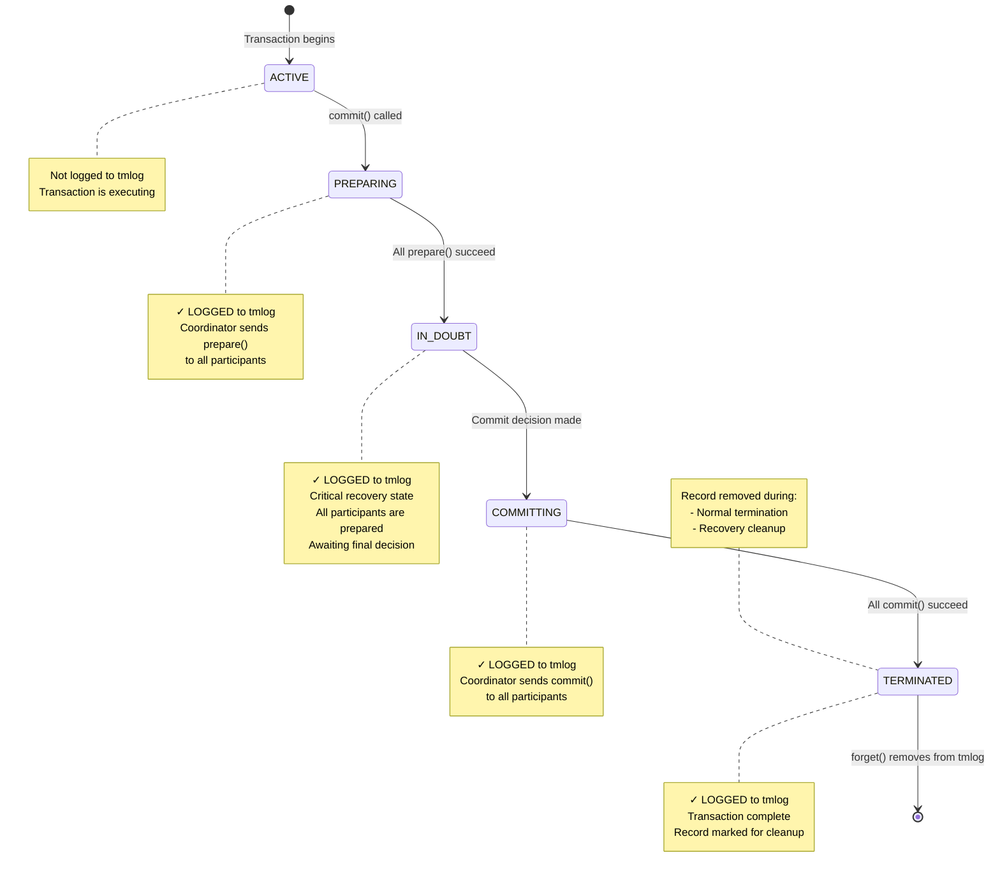

# Atomikos Transaction Log (tmlog) Research

This document provides a comprehensive analysis of how Atomikos uses its transaction log (tmlog) file, including transaction states, transitions, and behavior in various scenarios.

## Table of Contents
- [Overview](#overview)
- [When Transactions are Stored to tmlog](#when-transactions-are-stored-to-tmlog)
- [When Transactions are Removed from tmlog](#when-transactions-are-removed-from-tmlog)
- [Transaction States](#transaction-states)
- [Scenario 1: Successful Transaction](#scenario-1-successful-transaction)
- [Scenario 2: Commit Failure After Prepare Success](#scenario-2-commit-failure-after-prepare-success)
- [Scenario 3: Queue Succeeded, Database Failed, No Prepared Transaction](#scenario-3-queue-succeeded-database-failed-no-prepared-transaction)
- [Critical Question: Rollback After Prepare Success?](#critical-question-rollback-after-prepare-success)

---

## Overview

Atomikos uses a transaction log file (tmlog) to ensure ACID properties and enable recovery in case of system failures. The log follows the Two-Phase Commit (2PC) protocol and records transactions in **recoverable states** to ensure proper recovery.

### Key Components

- **StateRecoveryManagerImp**: Listens to FSM (Finite State Machine) state transitions and triggers logging
- **OltpLogImp**: Validates and persists transaction records to the repository
- **RecoveryLogImp**: Manages recovery operations and cleanup
- **RecoveryDomainService**: Performs periodic recovery scans for expired transactions

---

## When Transactions are Stored to tmlog

Transactions are written to the tmlog when they enter **recoverable states**. This happens through the following process:

1. **Trigger**: When a transaction coordinator transitions to a recoverable state
2. **States that trigger logging**:
   - `PREPARING` - Prepare phase in progress
   - `IN_DOUBT` - Waiting for commit/abort decision (most critical for recovery)
   - `COMMITTING` - Commit phase in progress
   - `ABORTING` - Rollback phase in progress
   - `HEUR_COMMITTED` - Heuristically committed
   - `HEUR_ABORTED` - Heuristically rolled back
   - `HEUR_MIXED` - Mixed outcome across participants
   - `HEUR_HAZARD` - Uncertain outcome

3. **Process Flow**:
   ```
   Coordinator enters recoverable state
   → StateRecoveryManagerImp.preEnter() is called
   → PendingTransactionRecord is created from coordinator state
   → OltpLogImp.write() persists the record to repository
   ```

4. **Non-recoverable states** (NOT logged):
   - `ACTIVE` - Transaction is running (not yet prepared)
   - `MARKED_ABORT` - Rollback-only flag set
   - `COMMITTED` - Successfully committed (terminal state, no recovery needed)
   - `ABORTED` - Rolled back (terminal state, no recovery needed)
   - `ABANDONED` - Timed out without resolution

**Implementation References**:
- `StateRecoveryManagerImp.java` (lines 34-51)
- `OltpLogImp.java` (line 48) - Validates recoverable states

---

## When Transactions are Removed from tmlog

Transactions are removed or marked as terminated in two scenarios:

### Scenario A: Normal Termination

When a transaction completes (successfully or with failure):

1. **Trigger**: Transaction reaches a final state
2. **Process**:
   ```
   RecoveryLogImp.forget(coordinatorId) is called
   → Record is marked as TERMINATED state
   → Record is updated in repository (state change, not deletion)
   ```

**Implementation Reference**: `RecoveryLogImp.java` (lines 98-102)

### Scenario B: Recovery Cleanup

During periodic recovery scans:

1. **Expired COMMITTING transactions**: Automatically forgotten after timeout
2. **Expired IN_DOUBT transactions**: Forgotten if beyond `maxTimeout`
3. **Foreign IN_DOUBT coordinators**: Forgotten for heuristic abort scenarios
4. **Process**:
   ```
   RecoveryDomainService performs periodic scans
   → Identifies expired transactions
   → Calls RecoveryLogImp.forgetTransactionRecords()
   → Removes all expired records from repository
   ```

**Implementation References**:
- `RecoveryLogImp.java` (lines 75-83)
- `RecoveryDomainService.java` (recovery logic)

---

## Transaction States

Atomikos defines transaction states in the `TxState` enum:

### Operational States (OLTP)
- **ACTIVE**: Transaction is running, no logging
- **MARKED_ABORT**: Rollback-only flag set
- **LOCALLY_DONE**: Preparation/termination phase
- **COMMITTED**: Successfully committed (terminal)
- **ABORTED**: Rolled back (terminal)
- **ABANDONED**: Timed out without resolution

### Recoverable States (Logged to tmlog)
- **PREPARING**: Prepare phase in progress
- **IN_DOUBT**: Waiting for commit/abort decision (critical!)
- **COMMITTING**: Commit phase in progress
- **ABORTING**: Rollback phase in progress

### Heuristic/Final States
- **HEUR_COMMITTED**: Heuristically committed
- **HEUR_ABORTED**: Heuristically rolled back
- **HEUR_MIXED**: Mixed outcome (some resources committed, others rolled back)
- **HEUR_HAZARD**: Uncertain outcome (need manual intervention)
- **TERMINATED**: Final cleanup marker

### State Transition Rules

From `TxState.java`, these transitions are enforced:

- **ACTIVE** → PREPARING, COMMITTING, ABORTING
- **PREPARING** → IN_DOUBT, ABORTING, TERMINATED, ABANDONED
- **IN_DOUBT** → ABORTING, COMMITTING, ABANDONED, TERMINATED
- **COMMITTING** → HEUR_ABORTED, HEUR_COMMITTED, HEUR_HAZARD, HEUR_MIXED, TERMINATED, ABANDONED
- **ABORTING** → HEUR_ABORTED, HEUR_COMMITTED, HEUR_HAZARD, HEUR_MIXED, TERMINATED, ABANDONED

---

## Scenario 1: Successful Transaction

This diagram shows a typical successful 2PC transaction with two participants (e.g., Database and Queue Manager).



### Detailed Flow for Successful Transaction:

1. **ACTIVE** (not logged): Transaction starts, application executes business logic
2. **PREPARING** (logged): 
   - Transaction manager calls `prepare()` on Database participant → Vote: YES
   - Transaction manager calls `prepare()` on Queue Manager participant → Vote: YES
3. **IN_DOUBT** (logged): 
   - All participants voted YES
   - Coordinator makes COMMIT decision
   - Critical state: if crash occurs here, recovery will commit
4. **COMMITTING** (logged):
   - Coordinator calls `commit()` on Database → SUCCESS
   - Coordinator calls `commit()` on Queue Manager → SUCCESS
5. **TERMINATED** (logged):
   - All resources committed successfully
   - Record marked as TERMINATED
6. **Removed from tmlog**: `forget()` is called, record is removed

---

## Scenario 2: Commit Failure After Prepare Success

This diagram shows what happens when prepare succeeds on all participants, but commit fails on one resource (Database) after succeeding on another (Queue Manager).


### Detailed Flow for Failed Commit Scenario:

1. **ACTIVE** (not logged): Transaction starts normally
2. **PREPARING** (logged):
   - `prepare()` on Database → Vote: YES ✓
   - `prepare()` on Queue Manager → Vote: YES ✓
3. **IN_DOUBT** (logged):
   - All participants prepared successfully
   - Coordinator makes COMMIT decision (cannot be changed!)
4. **COMMITTING** (logged):
   - `commit()` on Queue Manager → SUCCESS ✓
   - `commit()` on Database → **EXCEPTION** ✗
   - Exception wrapped as `HeurHazardException` (CommitMessage.java, lines 54-67)
5. **HEUR_HAZARD** (logged):
   - Transaction enters heuristic hazard state
   - Queue Manager has committed (cannot be undone)
   - Database outcome is unknown
   - Retry flag is set for recovery attempts
6. **Recovery Attempts**:
   - Recovery service periodically scans for expired COMMITTING/HEUR_HAZARD transactions
   - Attempts to retry commit on Database
   - Three possible outcomes:
     - **Success** → TERMINATED (Database eventually commits)
     - **Permanent Failure** → HEUR_MIXED (Database rolled back, Queue Manager committed)
     - **Timeout** → ABANDONED (maxTimeout exceeded, needs manual intervention)

---

## Critical Question: Rollback After Prepare Success?

### ❌ NO - Atomikos Will NOT Send a Rollback

**Question**: In the scenario where prepare succeeds but commit fails on the database (after succeeding on queue manager), will Atomikos send a rollback to the database resource after prepare succeeded and commit failed?

**Answer**: **NO, Atomikos will NOT automatically send a rollback to the database.**

### Why No Rollback?

Once a transaction enters the **IN_DOUBT** state (after all participants vote YES during prepare), the coordinator makes an **irrevocable COMMIT decision**. According to the Two-Phase Commit protocol:

1. **Prepare Phase**: All participants vote YES or NO
   - If any participant votes NO → coordinator decides ROLLBACK
   - If all participants vote YES → coordinator decides **COMMIT** (cannot change!)

2. **Commit Phase**: Coordinator executes the decision
   - The decision is **durably logged** (IN_DOUBT → COMMITTING state)
   - The decision cannot be reversed, even if commit fails on some participants

### What Actually Happens?

When commit fails on Database after succeeding on Queue Manager:

1. **No Rollback Sent**: The Database is NOT told to rollback
2. **Heuristic State**: Transaction enters `HEUR_HAZARD` or `HEUR_MIXED` state
3. **Recovery Retries**: Recovery service attempts to retry commit on Database
4. **Possible Outcomes**:
   - **Database eventually commits** → Consistent state reached
   - **Database rolled back** → `HEUR_MIXED` state (inconsistent!)
   - **Database remains in-doubt** → `HEUR_HAZARD` state (manual intervention needed)

### Code Evidence

From `CommitMessage.java` (lines 54-67):
```java
// When commit throws ANY exception (except heuristic exceptions):
// It wraps it as HeurHazardException with retry=true
// Transaction enters HEUR_HAZARD state, NOT rolled back
```

From `TxState.java`:
```java
// Legal transitions from COMMITTING state:
COMMITTING → HEUR_ABORTED, HEUR_COMMITTED, HEUR_HAZARD, HEUR_MIXED, 
             TERMINATED, ABANDONED
// Note: ABORTING is NOT a legal transition from COMMITTING
```

From `IndoubtStateHandler.java` and `HeurHazardStateHandler.java`:
- Recovery logic attempts to **replay the commit decision**
- If Database times out, it may perform **heuristic abort** (Database's decision, not coordinator's)
- Coordinator never sends explicit rollback after IN_DOUBT state

### Summary

Once the coordinator makes a COMMIT decision (after successful prepare), it is **committed to committing**. If a participant fails during commit:

- ✓ Coordinator will **retry commit** during recovery
- ✓ Transaction enters **heuristic state** if outcome is uncertain
- ✗ Coordinator will **NOT send rollback** to prepared participants
- ⚠️ **Inconsistent state possible** (HEUR_MIXED) requiring manual intervention

This behavior ensures that the transaction manager adheres to the Two-Phase Commit protocol's durability guarantees while exposing the inherent risk of heuristic outcomes when commit failures occur.

---

## Implementation References

Key source files analyzed:

- `TxState.java` - State definitions and transition rules
- `StateRecoveryManagerImp.java` - Triggers logging on state entry (lines 34-51)
- `OltpLogImp.java` - Validates and persists records (line 48)
- `RecoveryLogImp.java` - Recovery and cleanup operations (lines 75-102)
- `RecoveryDomainService.java` - Periodic recovery scans
- `CommitMessage.java` - Commit phase implementation (lines 54-67)
- `TerminationResult.java` - Heuristic outcome detection (lines 111-117)
- `HeurHazardStateHandler.java` - Handles HEUR_HAZARD state
- `HeurMixedStateHandler.java` - Handles HEUR_MIXED state
- `IndoubtStateHandler.java` - Handles IN_DOUBT state and timeout

---

## Conclusion

Atomikos' tmlog file is a critical component for ensuring transaction durability and recovery. Key takeaways:

1. **Only recoverable states are logged** (PREPARING, IN_DOUBT, COMMITTING, ABORTING, HEUR_*)
2. **IN_DOUBT state is the most critical** - it represents the point of no return for commit decision
3. **Recovery is retry-based** - The system attempts to complete the original decision, not reverse it
4. **Heuristic outcomes are possible** - When participants cannot be reached or fail, manual intervention may be needed
5. **No automatic rollback after prepare** - Once committed to commit, the system tries to commit, not rollback

This design ensures ACID properties while exposing the fundamental limitations of distributed transactions.

---


## Scenario 3: Queue Succeeded, Database Failed, No Prepared Transaction

### Real-World Problem

A common scenario encountered in production:
- **Message appeared in the queue** (visible to consumers)
- **Record did NOT appear in database** (failed)
- **Oracle DBA found NO prepared transactions** in the database
- **tmlog files were not available** for inspection at the time of the issue

**Question**: What is the most likely explanation for this scenario? Could the transaction have timed out and been rolled back?

### Answer: Oracle Prepared Transaction Timeout or Commit Phase Failure

**Important Clarification**: Since the message **is visible in the queue**, this means the queue resource **successfully committed**. In XA transactions, messages are locked and invisible until commit succeeds. Therefore, prepare must have succeeded on both resources, and the commit phase must have started.

**Most Likely Scenarios** (in order of probability):

1. **Oracle prepared transaction timed out** before Atomikos could commit it
2. **Commit phase failed on database** after succeeding on queue
3. **Oracle heuristically rolled back** the prepared transaction

### Why This Happens

#### Understanding XA Transaction Flow

**Critical Fact**: In JMS/XA transactions, messages are sent during application code but remain **invisible** (locked) until the transaction commits. The message only becomes visible to consumers after a successful commit.

```
Application Code:
  producer.send(message)  ← Message sent but LOCKED in queue
  dao.insert(record)       ← Database operation executed
  
Transaction Commit:
  prepare(queue)    → Vote: YES  (message still locked)
  prepare(database) → Vote: YES  (DB in prepared state)
  [IN_DOUBT state reached - logged to tmlog]
  
  commit(queue)     → SUCCESS ✓ (message now VISIBLE)
  commit(database)  → ??? 
```

Since the message **is visible**, we know:
- Prepare succeeded on both resources
- IN_DOUBT state was reached
- Commit was sent to queue and succeeded
- Something went wrong with the database commit

#### Timeline of Events:


### Detailed Scenarios

#### Scenario A: Oracle XA Prepared Transaction Timeout (Most Likely)

**What Happened**:
1. Transaction starts, message sent (locked), database operation executed
2. `commit()` called, both resources prepare successfully
3. Oracle creates a prepared XA transaction with timeout (default from Atomikos)
4. Transaction enters IN_DOUBT state, logged to tmlog
5. **Delay occurs** before commit phase (network issue, system load, GC pause)
6. **Oracle's XA timeout expires** (typically 60 seconds default)
7. **Oracle automatically rolls back** the prepared transaction to free resources
8. Oracle removes the in-doubt transaction from its internal tables
9. Atomikos finally sends commit to both resources:
   - Queue commits successfully → **message becomes visible**
   - Database commit fails with "transaction not found" or similar error
10. Atomikos enters HEUR_HAZARD or HEUR_MIXED state

**Why Oracle Shows No Prepared Transaction**:
- Oracle had a prepared transaction but its timeout expired
- Oracle's automatic cleanup rolled it back
- By the time the DBA checked (days later), the transaction was long gone

**Evidence to Look For**:
- Oracle alert logs: `ORA-24756: transaction does not exist`
- Atomikos logs: `HeurHazardException` or `HeurMixedException` 
- Check if Atomikos transaction timeout > Oracle XA timeout

**Oracle XA Timeout Configuration**:
```sql
-- Check Oracle XA transaction timeout (default 60 seconds)
SELECT name, value FROM v$parameter WHERE name = 'distributed_lock_timeout';

-- Check for timed-out distributed transactions
SELECT * FROM dba_2pc_pending WHERE state = 'forced rollback';
```

#### Scenario B: Commit Phase Failure After Partial Success

**What Happened**:
1. Both resources prepare successfully
2. Transaction enters IN_DOUBT state
3. Atomikos sends commit to both resources (order is indeterminate)
4. **Queue commits first** → message becomes visible
5. **Database commit fails**:
   - Connection lost during commit
   - Database crashed between prepare and commit
   - Network partition
   - Oracle instance failure
6. Atomikos receives success from queue, failure from database
7. Transaction enters HEUR_MIXED state

**Why Oracle Shows No Prepared Transaction**:
- If Oracle crashed, prepared transactions are rolled back on restart
- If connection was lost, Oracle may have cleaned up the XA transaction
- The prepared state doesn't persist across Oracle instance restarts without proper configuration

**Evidence to Look For**:
- Atomikos logs: `HeurMixedException` with details about which resource failed
- Oracle alert logs: Instance crash or connection errors
- Network logs: Connection failures during commit window

#### Scenario C: Oracle Heuristic Rollback Decision

**What Happened**:
1. Both resources prepare successfully
2. Transaction enters IN_DOUBT state
3. Before Atomikos sends commit, Oracle's resource manager makes a **heuristic decision**
4. Oracle times out and decides to rollback the prepared transaction
5. Queue receives commit and succeeds
6. Database returns `XA_HEURRB` (heuristic rollback)
7. Transaction enters HEUR_MIXED state

**Why Oracle Shows No Prepared Transaction**:
- Oracle decided to rollback before receiving commit instruction
- Prepared transaction was removed by Oracle's heuristic decision

**Evidence to Look For**:
- Atomikos logs: `XAException` with error code `XA_HEURRB` (heuristic rollback)
- Oracle logs: Heuristic rollback decision logged

### Key Findings

#### Why The Message Is Visible

**Critical Point**: The fact that the message is visible in the queue proves that:
1. The queue resource **successfully committed**
2. The prepare phase **succeeded on both resources** (otherwise queue would have rolled back)
3. The transaction **reached IN_DOUBT state** (both voted YES)
4. The commit phase **was initiated and succeeded on the queue**

This completely rules out the theory that prepare failed on the database.

#### Why Oracle Shows No Prepared Transaction

Possible reasons:
1. **Timeout expiry**: Oracle's XA timeout expired and Oracle rolled back automatically
2. **Crash recovery**: Oracle instance crashed and rolled back prepared transactions on restart
3. **Heuristic decision**: Oracle's XA resource manager decided to rollback due to timeout
4. **Manual intervention**: DBA manually rolled back the prepared transaction
5. **Connection cleanup**: Lost connection caused Oracle to cleanup the XA transaction

#### Atomikos tmlog State

Without the tmlog files, we can't know for certain, but the transaction likely:
- Was logged in IN_DOUBT or COMMITTING state
- Later transitioned to HEUR_MIXED or HEUR_HAZARD state
- Eventually was marked as TERMINATED or ABANDONED after timeout
- Log entry may have been cleaned up days later by recovery service

### Timeout Configuration Analysis

#### Atomikos Transaction Timeout

From `transactions-defaults.properties`:
```properties
com.atomikos.icatch.default_jta_timeout=10000    # 10 seconds
com.atomikos.icatch.max_timeout=300000            # 5 minutes
```

This timeout is set on XA resources via `XAResource.setTransactionTimeout()`.

#### Oracle XA Transaction Timeout

Oracle has its own timeout for prepared transactions:
```sql
-- Default is 60 seconds
distributed_lock_timeout = 60

-- If Atomikos timeout (10s) < Oracle timeout (60s)
-- Oracle will keep the prepared TX for up to 60 seconds
-- If commit doesn't arrive within 60s, Oracle may rollback
```

#### The Timing Problem

If there's a delay between prepare and commit:
```
T=0s:    Application starts transaction
T=5s:    commit() called
T=5.5s:  Prepare phase completes (both YES)
T=5.5s:  IN_DOUBT state, tmlog written
T=5.5s:  Atomikos tries to send commit messages
         -- DELAY HAPPENS HERE --
T=65s:   Oracle timeout (60s) expires
T=65s:   Oracle rolls back prepared transaction
T=70s:   Atomikos commit finally reaches resources
T=70s:   Queue commits successfully (message visible)
T=70s:   Database commit fails (transaction not found)
T=70s:   HEUR_MIXED state
```

### Diagnostics and Prevention

#### To Diagnose Root Cause:

1. **Check Atomikos logs** for:
   ```
   HeurMixedException
   HeurHazardException  
   XAException with error codes:
   - XA_HEURRB (heuristic rollback)
   - XA_HEURMIX (heuristic mixed)
   - XAER_NOTA (transaction not found)
   ```

2. **Check Oracle alert logs** for:
   ```
   ORA-24756: transaction does not exist
   ORA-02051: another session  in same transaction failed
   Distributed transaction timeout
   Instance crash/restart during the time window
   ```

3. **Check Oracle DBA_2PC_PENDING**:
   ```sql
   SELECT local_tran_id, state, tran_comment, fail_time, commit#
   FROM dba_2pc_pending
   WHERE fail_time BETWEEN <incident_start> AND <incident_end>;
   ```

4. **Check for GC pauses or system delays**:
   - JVM garbage collection logs
   - System load at the time of incident
   - Network latency monitoring

#### To Prevent This Issue:

1. **Align timeouts properly**:
   ```properties
   # Increase Atomikos timeout to allow for delays
   com.atomikos.icatch.default_jta_timeout=30000  # 30 seconds
   
   # Ensure Oracle timeout > Atomikos timeout
   # In Oracle: ALTER SYSTEM SET distributed_lock_timeout = 120;
   ```

2. **Enable single-threaded 2PC** (for consistent commit ordering):
   ```properties
   com.atomikos.icatch.single_threaded_2pc=true
   ```
   This ensures queue doesn't commit before database.

3. **Monitor transaction duration**:
   - Alert if time between prepare and commit exceeds threshold
   - Log slow transactions
   - Monitor queue and database latency separately

4. **Implement idempotent message consumers**:
   - Always check if database record exists before processing message
   - Use unique message IDs to detect duplicates
   - Handle "message without database record" gracefully

5. **Enable Oracle Distributed Transaction Recovery**:
   ```sql
   -- Configure pending transaction resolution
   ALTER SYSTEM SET distributed_recovery_connection_hold_time = 200;
   ```

6. **Use tmlog archiving**:
   - Configure Atomikos to archive tmlog files
   - Retain logs for analysis
   - Monitor for HEUR_MIXED transactions

### Summary for Your Specific Scenario

**What Most Likely Happened**:

Since the message **is visible in the queue**, this proves:
- Both prepare() calls succeeded
- Transaction reached IN_DOUBT state
- Queue commit() succeeded
- Database commit() either:
  a) Never was called due to crash
  b) Was called but transaction had already timed out in Oracle
  c) Failed due to connection/network issue

**Why Oracle shows no prepared transaction**:
- The prepared transaction existed temporarily after prepare succeeded
- Oracle's timeout (60s default) expired before Atomikos sent the commit
- Oracle automatically rolled back the prepared transaction
- By the time DBA checked days later, Oracle had cleaned up all trace of it

**Why the message persists**:
- Queue committed successfully in the commit phase
- This is a **HEUR_MIXED state** - different outcomes for different resources
- This is the inherent risk of distributed transactions

**Could this have been prevented?**:
- YES - by ensuring Oracle's XA timeout > Atomikos transaction timeout
- YES - by using single-threaded 2PC to control commit order
- YES - by monitoring and alerting on slow transaction phases
- PARTIAL - by implementing idempotent consumers to handle orphaned messages

**Conclusion**: This is **not a prepare phase failure** but rather a **commit phase timing issue** where Oracle's prepared transaction timed out before Atomikos could complete the commit phase. The queue committed successfully but the database had already cleaned up its prepared state, resulting in a heuristic mixed outcome.
