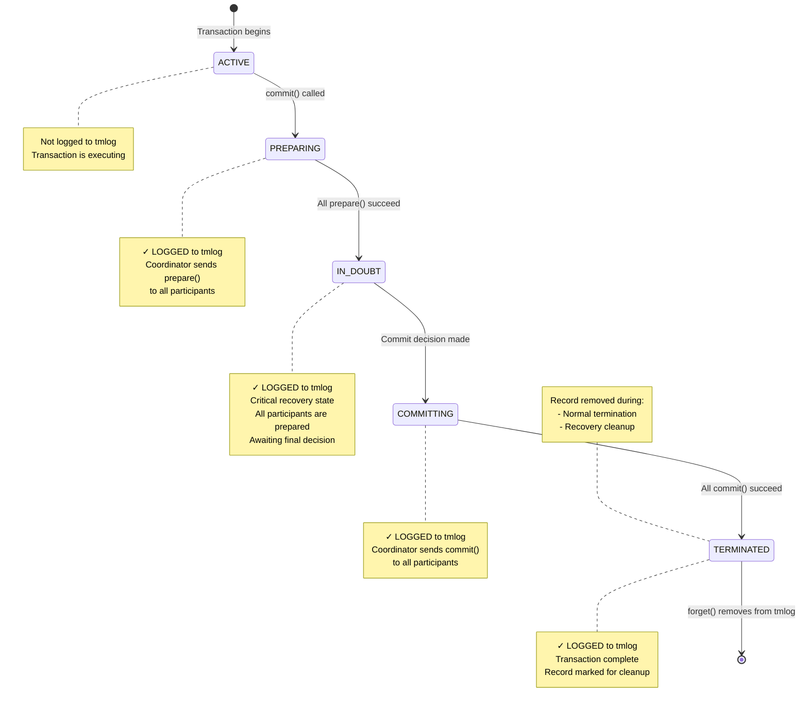

# Atomikos Transaction Log (tmlog) Research

This document provides a comprehensive analysis of how Atomikos uses its transaction log (tmlog) file, including transaction states, transitions, and behavior in various scenarios.

## Table of Contents
- [Overview](#overview)
- [When Transactions are Stored to tmlog](#when-transactions-are-stored-to-tmlog)
- [When Transactions are Removed from tmlog](#when-transactions-are-removed-from-tmlog)
- [Transaction States](#transaction-states)
- [Timeout Configuration and ABANDONED State](#timeout-configuration-and-abandoned-state)
- [Scenario 1: Successful Transaction](#scenario-1-successful-transaction)
- [Scenario 2: Commit Failure After Prepare Success](#scenario-2-commit-failure-after-prepare-success)
- [Scenario 3: Queue Succeeded, Database Failed, No Prepared Transaction](#scenario-3-queue-succeeded-database-failed-no-prepared-transaction)
- [Detailed Simulation: Queue Commits, DB Fails, Then DB Times Out](#detailed-simulation-queue-commits-db-fails-then-db-times-out)
- [Critical Question: Rollback After Prepare Success?](#critical-question-rollback-after-prepare-success)

---

## Overview

Atomikos uses a transaction log file (tmlog) to ensure ACID properties and enable recovery in case of system failures. The log follows the Two-Phase Commit (2PC) protocol and records transactions in **recoverable states** to ensure proper recovery.

### Key Components

- **StateRecoveryManagerImp**: Listens to FSM (Finite State Machine) state transitions and triggers logging
- **OltpLogImp**: Validates and persists transaction records to the repository
- **RecoveryLogImp**: Manages recovery operations and cleanup
- **RecoveryDomainService**: Performs periodic recovery scans for expired transactions

---

## When Transactions are Stored to tmlog

Transactions are written to the tmlog when they enter **recoverable states**. This happens through the following process:

1. **Trigger**: When a transaction coordinator transitions to a recoverable state
2. **States that trigger logging**:
   - `PREPARING` - Prepare phase in progress
   - `IN_DOUBT` - Waiting for commit/abort decision (most critical for recovery)
   - `COMMITTING` - Commit phase in progress
   - `ABORTING` - Rollback phase in progress
   - `HEUR_COMMITTED` - Heuristically committed
   - `HEUR_ABORTED` - Heuristically rolled back
   - `HEUR_MIXED` - Mixed outcome across participants
   - `HEUR_HAZARD` - Uncertain outcome

3. **Process Flow**:
   ```
   Coordinator enters recoverable state
   → StateRecoveryManagerImp.preEnter() is called
   → PendingTransactionRecord is created from coordinator state
   → OltpLogImp.write() persists the record to repository
   ```

4. **Non-recoverable states** (NOT logged):
   - `ACTIVE` - Transaction is running (not yet prepared)
   - `MARKED_ABORT` - Rollback-only flag set
   - `COMMITTED` - Successfully committed (terminal state, no recovery needed)
   - `ABORTED` - Rolled back (terminal state, no recovery needed)
   - `ABANDONED` - Timed out without resolution

**Implementation References**:
- `StateRecoveryManagerImp.java` (lines 34-51)
- `OltpLogImp.java` (line 48) - Validates recoverable states

---

## When Transactions are Removed from tmlog

Transactions are removed or marked as terminated in two scenarios:

### Scenario A: Normal Termination

When a transaction completes (successfully or with failure):

1. **Trigger**: Transaction reaches a final state
2. **Process**:
   ```
   RecoveryLogImp.forget(coordinatorId) is called
   → Record is marked as TERMINATED state
   → Record is updated in repository (state change, not deletion)
   ```

**Implementation Reference**: `RecoveryLogImp.java` (lines 98-102)

### Scenario B: Recovery Cleanup

During periodic recovery scans:

1. **Expired COMMITTING transactions**: Automatically forgotten after timeout
2. **Expired IN_DOUBT transactions**: Forgotten if beyond `maxTimeout`
3. **Foreign IN_DOUBT coordinators**: Forgotten for heuristic abort scenarios
4. **Process**:
   ```
   RecoveryDomainService performs periodic scans
   → Identifies expired transactions
   → Calls RecoveryLogImp.forgetTransactionRecords()
   → Removes all expired records from repository
   ```

**Implementation References**:
- `RecoveryLogImp.java` (lines 75-83)
- `RecoveryDomainService.java` (recovery logic)

---

## Transaction States

Atomikos defines transaction states in the `TxState` enum:

### Operational States (OLTP)
- **ACTIVE**: Transaction is running, no logging
- **MARKED_ABORT**: Rollback-only flag set
- **LOCALLY_DONE**: Preparation/termination phase
- **COMMITTED**: Successfully committed (terminal)
- **ABORTED**: Rolled back (terminal)
- **ABANDONED**: Timed out without resolution

### Recoverable States (Logged to tmlog)
- **PREPARING**: Prepare phase in progress
- **IN_DOUBT**: Waiting for commit/abort decision (critical!)
- **COMMITTING**: Commit phase in progress
- **ABORTING**: Rollback phase in progress

### Heuristic/Final States
- **HEUR_COMMITTED**: Heuristically committed
- **HEUR_ABORTED**: Heuristically rolled back
- **HEUR_MIXED**: Mixed outcome (some resources committed, others rolled back)
- **HEUR_HAZARD**: Uncertain outcome (need manual intervention)
- **TERMINATED**: Final cleanup marker

### State Transition Rules

From `TxState.java`, these transitions are enforced:

- **ACTIVE** → PREPARING, COMMITTING, ABORTING
- **PREPARING** → IN_DOUBT, ABORTING, TERMINATED, ABANDONED
- **IN_DOUBT** → ABORTING, COMMITTING, ABANDONED, TERMINATED
- **COMMITTING** → HEUR_ABORTED, HEUR_COMMITTED, HEUR_HAZARD, HEUR_MIXED, TERMINATED, ABANDONED
- **ABORTING** → HEUR_ABORTED, HEUR_COMMITTED, HEUR_HAZARD, HEUR_MIXED, TERMINATED, ABANDONED

---

## Timeout Configuration and ABANDONED State

### Overview of Atomikos Timeouts

Atomikos uses several timeout configurations that control transaction lifecycle, recovery, and cleanup. Understanding these timeouts is critical for diagnosing issues like orphaned transactions, heuristic outcomes, and database inconsistencies.

### Atomikos Timeout Properties

All timeout configurations are set in `transactions-defaults.properties` or programmatically via the TransactionManager API.

#### 1. `default_jta_timeout`

**Property**: `com.atomikos.icatch.default_jta_timeout`  
**Default**: `10000` ms (10 seconds)  
**Purpose**: The default timeout applied when a new transaction starts

**What it controls**:
- Maximum time a transaction can run from `begin()` to `commit()`/`rollback()`
- If exceeded, the transaction is automatically rolled back
- Applied to all transactions unless overridden

**How to override**:
```java
// Programmatically set timeout for next transaction
userTransaction.setTransactionTimeout(30); // 30 seconds

// Or via annotation (Spring/Jakarta EE)
@Transactional(timeout = 30)
public void myMethod() { ... }
```

**Implementation**: `TransactionManagerImp.java` line 99-102

#### 2. `max_timeout`

**Property**: `com.atomikos.icatch.max_timeout`  
**Default**: `300000` ms (5 minutes)  
**Purpose**: Maximum allowed timeout for any transaction in the system

**What it controls**:
- Acts as a ceiling for transaction timeout values
- If `setTransactionTimeout(n)` is called with `n > max_timeout`, the value is capped at `max_timeout`
- Prevents transactions from running indefinitely

**Relationship to default_jta_timeout**:
```
0 ≤ individual transaction timeout ≤ max_timeout
default_jta_timeout is the initial value if not explicitly set
```

**Implementation**: `TransactionServiceImp.java` line 237-240

#### 3. `recovery_delay`

**Property**: `com.atomikos.icatch.recovery_delay` (not explicitly in defaults, uses `default_jta_timeout`)  
**Default**: Same as `default_jta_timeout` (10 seconds)  
**Purpose**: Delay between recovery scans for in-doubt transactions

**What it controls**:
- How often the recovery service scans tmlog for transactions requiring recovery
- Shorter delays = faster recovery but higher CPU usage
- Longer delays = slower recovery but lower overhead

#### 4. `forget_orphaned_log_entries_delay`

**Property**: `com.atomikos.icatch.forget_orphaned_log_entries_delay`  
**Default**: `86400000` ms (24 hours)  
**Purpose**: Delay before removing orphaned log entries from tmlog

**What it controls**:
- How long Atomikos keeps log entries for ABANDONED and old TERMINATED transactions
- After this delay, entries are permanently removed from tmlog
- Prevents tmlog from growing indefinitely

**Implementation**: `CachedRepository.java` - removes entries where `(entry.expires + forget_orphaned_log_entries_delay) < currentTime`

### Oracle XA Timeout Configuration

Oracle has its own timeout settings that interact with Atomikos:

#### 1. Oracle Distributed Lock Timeout

**Parameter**: `distributed_lock_timeout`  
**Default**: `60` seconds  
**Purpose**: Maximum time Oracle keeps a prepared XA transaction before automatically rolling it back

**How to check**:
```sql
SELECT name, value FROM v$parameter 
WHERE name = 'distributed_lock_timeout';
```

**How to change**:
```sql
ALTER SYSTEM SET distributed_lock_timeout = 120 SCOPE=BOTH;
```

**Critical Configuration Rule**:
```
Oracle distributed_lock_timeout SHOULD BE > Atomikos max_timeout

Example:
  Atomikos max_timeout = 300 seconds (5 minutes)
  Oracle distributed_lock_timeout = 360 seconds (6 minutes)
```

If Oracle timeout < Atomikos timeout, Oracle may rollback prepared transactions before Atomikos can commit them, causing HEUR_MIXED outcomes.

#### 2. Oracle XA Transaction Timeout (Set by Atomikos)

**How it works**: Atomikos calls `XAResource.setTransactionTimeout(seconds)` on Oracle XA resources

**Implementation**: `XAResourceTransaction.java` line 75:
```java
this.timeout = transaction.getTimeout() / 1000; // Convert ms to seconds
xaresource.setTransactionTimeout(this.timeout);
```

**What it does**:
- Tells Oracle how long to wait for commit/rollback after prepare
- If commit doesn't arrive within this time, Oracle may heuristically rollback

### ABANDONED State

#### What is ABANDONED?

**ABANDONED** is a transaction state indicating that a transaction exceeded `max_timeout` without completing, even in recovery states.

**Legal transitions TO ABANDONED**:
- PREPARING → ABANDONED
- IN_DOUBT → ABANDONED  
- COMMITTING → ABANDONED
- ABORTING → ABANDONED

#### When Does a Transaction Enter ABANDONED?

A transaction enters ABANDONED state when:

1. **Timeout in recoverable state**: Transaction is in PREPARING, IN_DOUBT, COMMITTING, or ABORTING state
2. **Max timeout exceeded**: The transaction has been in that state longer than `max_timeout`
3. **Recovery attempts exhausted**: Recovery service has tried to complete the transaction but failed

**Example timeline**:
```
T=0s:      Transaction starts
T=5s:      commit() called, enters PREPARING
T=6s:      prepare() succeeds on all resources, enters IN_DOUBT
T=7s:      COMMITTING state begins
T=10s:     Commit fails on database, enters HEUR_HAZARD
T=310s:    max_timeout (300s) exceeded
T=310s:    Transaction moves to ABANDONED state
```

**Implementation**: `CoordinatorStateHandler.java` lines 634-638:
```java
private void removePendingOltpCoordinatorFromTransactionService() {
    coordinator.setState(TxState.ABANDONED);
    coordinator.dispose();
    LOGGER.logWarning("Abandoning " + coordinator.getCoordinatorId() + 
        " in state " + state + " after timeout - recovery will cleanup in the background");
}
```

#### Is ABANDONED Logged to tmlog?

**NO** - ABANDONED is **NOT a recoverable state**. From the code analysis:

**Non-recoverable states** (never logged to tmlog):
- ACTIVE
- MARKED_ABORT
- COMMITTED
- ABORTED
- **ABANDONED** ← Not logged

When a transaction transitions to ABANDONED:
1. The coordinator is disposed (all resources released)
2. The state is set to ABANDONED locally
3. **No tmlog write occurs** for the ABANDONED state itself

However, the transaction may have been logged in a previous recoverable state (PREPARING, IN_DOUBT, COMMITTING, ABORTING) before transitioning to ABANDONED.

#### Is ABANDONED Eventually Removed from tmlog?

**YES** - Indirectly, via the cleanup mechanism for orphaned entries.

**The cleanup process**:

1. **Last logged state**: Before ABANDONED, the transaction was in a recoverable state (e.g., IN_DOUBT, HEUR_HAZARD) and was logged to tmlog

2. **Transition to ABANDONED**: When max_timeout is exceeded, the transaction moves to ABANDONED state locally (in memory), but this state change is NOT written to tmlog

3. **tmlog entry becomes orphaned**: The tmlog still has the old recoverable state entry (e.g., IN_DOUBT from T=6s), but the in-memory coordinator is now ABANDONED

4. **Expiry calculation**: Each tmlog entry has an expiry timestamp:
   ```
   entry.expires = entry.timestamp + transaction.timeout
   ```

5. **Orphaned entry removal**: After `forget_orphaned_log_entries_delay` (default 24 hours), the entry is removed:
   ```
   if (currentTime > entry.expires + forget_orphaned_log_entries_delay) {
       remove entry from tmlog
   }
   ```

**Timeline example**:
```
T=0s:      Transaction starts (timeout = 300s)
T=6s:      IN_DOUBT state, logged to tmlog with expires = T+300s = 306s
T=310s:    max_timeout exceeded, moves to ABANDONED (not logged)
T=306s:    tmlog entry "expires" timestamp passes
T=86706s:  forget_orphaned_log_entries_delay (24h) expires
T=86706s:  Recovery service removes the orphaned IN_DOUBT entry from tmlog
```

**Implementation**: `CachedRepository.java` cleanup logic removes entries based on:
```java
if (now > coordinatorLogEntry.expires + forgetOrphanedLogEntriesDelay) {
    repository.remove(coordinatorLogEntry);
}
```

### Timeout Interaction Summary

#### Scenario: Atomikos timeout < Oracle timeout

**Configuration**:
- Atomikos: `default_jta_timeout = 10s`, `max_timeout = 300s`
- Oracle: `distributed_lock_timeout = 60s`

**What happens**:
1. Transaction starts, runs for 8 seconds
2. `commit()` called at T=8s (2s before Atomikos timeout)
3. Both resources prepare successfully, IN_DOUBT state at T=8.5s
4. Atomikos attempts to send commit but experiences network delay
5. At T=18s, Atomikos transaction timeout (10s) expires
6. Atomikos marks transaction as timed out, but it's already in IN_DOUBT (cannot rollback)
7. Recovery attempts continue until T=308s (max_timeout)
8. At T=308s, transaction moves to ABANDONED state
9. At T=68.5s, Oracle's 60-second timeout expires, Oracle rolls back prepared transaction
10. Later, when Atomikos retry finally reaches Oracle: "transaction not found" error
11. Result: HEUR_MIXED state (if queue already committed)

**Problem**: Atomikos timeout doesn't prevent Oracle from making a heuristic decision.

#### Scenario: Oracle timeout < Atomikos timeout (DANGEROUS)

**Configuration**:
- Atomikos: `default_jta_timeout = 120s`, `max_timeout = 300s`  
- Oracle: `distributed_lock_timeout = 60s`

**What happens**:
1. Transaction prepares successfully on both resources at T=5s
2. IN_DOUBT state reached, commit decision made
3. Delay occurs before commit messages are sent (network lag, GC pause, etc.)
4. At T=65s, Oracle timeout (60s) expires **before** Atomikos sends commit
5. Oracle automatically rolls back the prepared transaction
6. At T=70s, Atomikos sends commit to both resources:
   - Queue commits successfully → message becomes visible
   - Oracle returns error: "ORA-24756: transaction does not exist"
7. Result: HEUR_MIXED state - queue committed, database rolled back

**Problem**: Oracle heuristically decides to rollback before Atomikos can execute its commit decision.

### Best Practices for Timeout Configuration

1. **Oracle timeout > Atomikos max_timeout**:
   ```properties
   # Atomikos
   com.atomikos.icatch.max_timeout=300000  # 5 minutes
   
   # Oracle
   distributed_lock_timeout=360  # 6 minutes
   ```

2. **Short default timeout, higher max**:
   ```properties
   com.atomikos.icatch.default_jta_timeout=30000    # 30 seconds (most transactions)
   com.atomikos.icatch.max_timeout=300000            # 5 minutes (for long-running)
   ```

3. **Monitor transaction duration**:
   - Alert if transactions approach timeout threshold
   - Log prepare-to-commit duration
   - Track ABANDONED transactions

4. **Tune forget_orphaned_log_entries_delay based on retention needs**:
   ```properties
   # Keep orphaned entries for 7 days for forensics
   com.atomikos.icatch.forget_orphaned_log_entries_delay=604800000
   ```

5. **Consider single-threaded 2PC** to control commit order:
   ```properties
   com.atomikos.icatch.single_threaded_2pc=true
   ```

---

## Scenario 1: Successful Transaction

This diagram shows a typical successful 2PC transaction with two participants (e.g., Database and Queue Manager).



### Detailed Flow for Successful Transaction:

1. **ACTIVE** (not logged): Transaction starts, application executes business logic
2. **PREPARING** (logged): 
   - Transaction manager calls `prepare()` on Database participant → Vote: YES
   - Transaction manager calls `prepare()` on Queue Manager participant → Vote: YES
3. **IN_DOUBT** (logged): 
   - All participants voted YES
   - Coordinator makes COMMIT decision
   - Critical state: if crash occurs here, recovery will commit
4. **COMMITTING** (logged):
   - Coordinator calls `commit()` on Database → SUCCESS
   - Coordinator calls `commit()` on Queue Manager → SUCCESS
5. **TERMINATED** (logged):
   - All resources committed successfully
   - Record marked as TERMINATED
6. **Removed from tmlog**: `forget()` is called, record is removed

---

## Scenario 2: Commit Failure After Prepare Success

This diagram shows what happens when prepare succeeds on all participants, but commit fails on one resource (Database) after succeeding on another (Queue Manager).


### Detailed Flow for Failed Commit Scenario:

1. **ACTIVE** (not logged): Transaction starts normally
2. **PREPARING** (logged):
   - `prepare()` on Database → Vote: YES ✓
   - `prepare()` on Queue Manager → Vote: YES ✓
3. **IN_DOUBT** (logged):
   - All participants prepared successfully
   - Coordinator makes COMMIT decision (cannot be changed!)
4. **COMMITTING** (logged):
   - `commit()` on Queue Manager → SUCCESS ✓
   - `commit()` on Database → **EXCEPTION** ✗
   - Exception wrapped as `HeurHazardException` (CommitMessage.java, lines 54-67)
5. **HEUR_HAZARD** (logged):
   - Transaction enters heuristic hazard state
   - Queue Manager has committed (cannot be undone)
   - Database outcome is unknown
   - Retry flag is set for recovery attempts
6. **Recovery Attempts**:
   - Recovery service periodically scans for expired COMMITTING/HEUR_HAZARD transactions
   - Attempts to retry commit on Database
   - Three possible outcomes:
     - **Success** → TERMINATED (Database eventually commits)
     - **Permanent Failure** → HEUR_MIXED (Database rolled back, Queue Manager committed)
     - **Timeout** → ABANDONED (maxTimeout exceeded, needs manual intervention)

---

## Critical Question: Rollback After Prepare Success?

### ❌ NO - Atomikos Will NOT Send a Rollback

**Question**: In the scenario where prepare succeeds but commit fails on the database (after succeeding on queue manager), will Atomikos send a rollback to the database resource after prepare succeeded and commit failed?

**Answer**: **NO, Atomikos will NOT automatically send a rollback to the database.**

### Why No Rollback?

Once a transaction enters the **IN_DOUBT** state (after all participants vote YES during prepare), the coordinator makes an **irrevocable COMMIT decision**. According to the Two-Phase Commit protocol:

1. **Prepare Phase**: All participants vote YES or NO
   - If any participant votes NO → coordinator decides ROLLBACK
   - If all participants vote YES → coordinator decides **COMMIT** (cannot change!)

2. **Commit Phase**: Coordinator executes the decision
   - The decision is **durably logged** (IN_DOUBT → COMMITTING state)
   - The decision cannot be reversed, even if commit fails on some participants

### What Actually Happens?

When commit fails on Database after succeeding on Queue Manager:

1. **No Rollback Sent**: The Database is NOT told to rollback
2. **Heuristic State**: Transaction enters `HEUR_HAZARD` or `HEUR_MIXED` state
3. **Recovery Retries**: Recovery service attempts to retry commit on Database
4. **Possible Outcomes**:
   - **Database eventually commits** → Consistent state reached
   - **Database rolled back** → `HEUR_MIXED` state (inconsistent!)
   - **Database remains in-doubt** → `HEUR_HAZARD` state (manual intervention needed)

### Code Evidence

From `CommitMessage.java` (lines 54-67):
```java
// When commit throws ANY exception (except heuristic exceptions):
// It wraps it as HeurHazardException with retry=true
// Transaction enters HEUR_HAZARD state, NOT rolled back
```

From `TxState.java`:
```java
// Legal transitions from COMMITTING state:
COMMITTING → HEUR_ABORTED, HEUR_COMMITTED, HEUR_HAZARD, HEUR_MIXED, 
             TERMINATED, ABANDONED
// Note: ABORTING is NOT a legal transition from COMMITTING
```

From `IndoubtStateHandler.java` and `HeurHazardStateHandler.java`:
- Recovery logic attempts to **replay the commit decision**
- If Database times out, it may perform **heuristic abort** (Database's decision, not coordinator's)
- Coordinator never sends explicit rollback after IN_DOUBT state

### Summary

Once the coordinator makes a COMMIT decision (after successful prepare), it is **committed to committing**. If a participant fails during commit:

- ✓ Coordinator will **retry commit** during recovery
- ✓ Transaction enters **heuristic state** if outcome is uncertain
- ✗ Coordinator will **NOT send rollback** to prepared participants
- ⚠️ **Inconsistent state possible** (HEUR_MIXED) requiring manual intervention

This behavior ensures that the transaction manager adheres to the Two-Phase Commit protocol's durability guarantees while exposing the inherent risk of heuristic outcomes when commit failures occur.

---

## Implementation References

Key source files analyzed:

- `TxState.java` - State definitions and transition rules
- `StateRecoveryManagerImp.java` - Triggers logging on state entry (lines 34-51)
- `OltpLogImp.java` - Validates and persists records (line 48)
- `RecoveryLogImp.java` - Recovery and cleanup operations (lines 75-102)
- `RecoveryDomainService.java` - Periodic recovery scans
- `CommitMessage.java` - Commit phase implementation (lines 54-67)
- `TerminationResult.java` - Heuristic outcome detection (lines 111-117)
- `HeurHazardStateHandler.java` - Handles HEUR_HAZARD state
- `HeurMixedStateHandler.java` - Handles HEUR_MIXED state
- `IndoubtStateHandler.java` - Handles IN_DOUBT state and timeout

---

## Conclusion

Atomikos' tmlog file is a critical component for ensuring transaction durability and recovery. Key takeaways:

1. **Only recoverable states are logged** (PREPARING, IN_DOUBT, COMMITTING, ABORTING, HEUR_*)
2. **IN_DOUBT state is the most critical** - it represents the point of no return for commit decision
3. **Recovery is retry-based** - The system attempts to complete the original decision, not reverse it
4. **Heuristic outcomes are possible** - When participants cannot be reached or fail, manual intervention may be needed
5. **No automatic rollback after prepare** - Once committed to commit, the system tries to commit, not rollback

This design ensures ACID properties while exposing the fundamental limitations of distributed transactions.

---


## Scenario 3: Queue Succeeded, Database Failed, No Prepared Transaction

### Real-World Problem

A common scenario encountered in production:
- **Message appeared in the queue** (visible to consumers)
- **Record did NOT appear in database** (failed)
- **Oracle DBA found NO prepared transactions** in the database
- **tmlog files were not available** for inspection at the time of the issue

**Question**: What is the most likely explanation for this scenario? Could the transaction have timed out and been rolled back?

### Answer: Oracle Prepared Transaction Timeout or Commit Phase Failure

**Important Clarification**: Since the message **is visible in the queue**, this means the queue resource **successfully committed**. In XA transactions, messages are locked and invisible until commit succeeds. Therefore, prepare must have succeeded on both resources, and the commit phase must have started.

**Most Likely Scenarios** (in order of probability):

1. **Oracle prepared transaction timed out** before Atomikos could commit it
2. **Commit phase failed on database** after succeeding on queue
3. **Oracle heuristically rolled back** the prepared transaction

### Why This Happens

#### Understanding XA Transaction Flow

**Critical Fact**: In JMS/XA transactions, messages are sent during application code but remain **invisible** (locked) until the transaction commits. The message only becomes visible to consumers after a successful commit.

```
Application Code:
  producer.send(message)  ← Message sent but LOCKED in queue
  dao.insert(record)       ← Database operation executed
  
Transaction Commit:
  prepare(queue)    → Vote: YES  (message still locked)
  prepare(database) → Vote: YES  (DB in prepared state)
  [IN_DOUBT state reached - logged to tmlog]
  
  commit(queue)     → SUCCESS ✓ (message now VISIBLE)
  commit(database)  → ??? 
```

Since the message **is visible**, we know:
- Prepare succeeded on both resources
- IN_DOUBT state was reached
- Commit was sent to queue and succeeded
- Something went wrong with the database commit

#### Timeline of Events:


### Detailed Scenarios

#### Scenario A: Oracle XA Prepared Transaction Timeout (Most Likely)

**What Happened**:
1. Transaction starts, message sent (locked), database operation executed
2. `commit()` called, both resources prepare successfully
3. Oracle creates a prepared XA transaction with timeout (default from Atomikos)
4. Transaction enters IN_DOUBT state, logged to tmlog
5. **Delay occurs** before commit phase (network issue, system load, GC pause)
6. **Oracle's XA timeout expires** (typically 60 seconds default)
7. **Oracle automatically rolls back** the prepared transaction to free resources
8. Oracle removes the in-doubt transaction from its internal tables
9. Atomikos finally sends commit to both resources:
   - Queue commits successfully → **message becomes visible**
   - Database commit fails with "transaction not found" or similar error
10. Atomikos enters HEUR_HAZARD or HEUR_MIXED state

**Why Oracle Shows No Prepared Transaction**:
- Oracle had a prepared transaction but its timeout expired
- Oracle's automatic cleanup rolled it back
- By the time the DBA checked (days later), the transaction was long gone

**Evidence to Look For**:
- Oracle alert logs: `ORA-24756: transaction does not exist`
- Atomikos logs: `HeurHazardException` or `HeurMixedException` 
- Check if Atomikos transaction timeout > Oracle XA timeout

**Oracle XA Timeout Configuration**:
```sql
-- Check Oracle XA transaction timeout (default 60 seconds)
SELECT name, value FROM v$parameter WHERE name = 'distributed_lock_timeout';

-- Check for timed-out distributed transactions
SELECT * FROM dba_2pc_pending WHERE state = 'forced rollback';
```

#### Scenario B: Commit Phase Failure After Partial Success

**What Happened**:
1. Both resources prepare successfully
2. Transaction enters IN_DOUBT state
3. Atomikos sends commit to both resources (order is indeterminate)
4. **Queue commits first** → message becomes visible
5. **Database commit fails**:
   - Connection lost during commit
   - Database crashed between prepare and commit
   - Network partition
   - Oracle instance failure
6. Atomikos receives success from queue, failure from database
7. Transaction enters HEUR_MIXED state

**Why Oracle Shows No Prepared Transaction**:
- If Oracle crashed, prepared transactions are rolled back on restart
- If connection was lost, Oracle may have cleaned up the XA transaction
- The prepared state doesn't persist across Oracle instance restarts without proper configuration

**Evidence to Look For**:
- Atomikos logs: `HeurMixedException` with details about which resource failed
- Oracle alert logs: Instance crash or connection errors
- Network logs: Connection failures during commit window

#### Scenario C: Oracle Heuristic Rollback Decision

**What Happened**:
1. Both resources prepare successfully
2. Transaction enters IN_DOUBT state
3. Before Atomikos sends commit, Oracle's resource manager makes a **heuristic decision**
4. Oracle times out and decides to rollback the prepared transaction
5. Queue receives commit and succeeds
6. Database returns `XA_HEURRB` (heuristic rollback)
7. Transaction enters HEUR_MIXED state

**Why Oracle Shows No Prepared Transaction**:
- Oracle decided to rollback before receiving commit instruction
- Prepared transaction was removed by Oracle's heuristic decision

**Evidence to Look For**:
- Atomikos logs: `XAException` with error code `XA_HEURRB` (heuristic rollback)
- Oracle logs: Heuristic rollback decision logged

### Key Findings

#### Why The Message Is Visible

**Critical Point**: The fact that the message is visible in the queue proves that:
1. The queue resource **successfully committed**
2. The prepare phase **succeeded on both resources** (otherwise queue would have rolled back)
3. The transaction **reached IN_DOUBT state** (both voted YES)
4. The commit phase **was initiated and succeeded on the queue**

This completely rules out the theory that prepare failed on the database.

#### Why Oracle Shows No Prepared Transaction

Possible reasons:
1. **Timeout expiry**: Oracle's XA timeout expired and Oracle rolled back automatically
2. **Crash recovery**: Oracle instance crashed and rolled back prepared transactions on restart
3. **Heuristic decision**: Oracle's XA resource manager decided to rollback due to timeout
4. **Manual intervention**: DBA manually rolled back the prepared transaction
5. **Connection cleanup**: Lost connection caused Oracle to cleanup the XA transaction

#### Atomikos tmlog State

Without the tmlog files, we can't know for certain, but the transaction likely:
- Was logged in IN_DOUBT or COMMITTING state
- Later transitioned to HEUR_MIXED or HEUR_HAZARD state
- Eventually was marked as TERMINATED or ABANDONED after timeout
- Log entry may have been cleaned up days later by recovery service

### Timeout Configuration Analysis

#### Atomikos Transaction Timeout

From `transactions-defaults.properties`:
```properties
com.atomikos.icatch.default_jta_timeout=10000    # 10 seconds
com.atomikos.icatch.max_timeout=300000            # 5 minutes
```

This timeout is set on XA resources via `XAResource.setTransactionTimeout()`.

#### Oracle XA Transaction Timeout

Oracle has its own timeout for prepared transactions:
```sql
-- Default is 60 seconds
distributed_lock_timeout = 60

-- If Atomikos timeout (10s) < Oracle timeout (60s)
-- Oracle will keep the prepared TX for up to 60 seconds
-- If commit doesn't arrive within 60s, Oracle may rollback
```

#### The Timing Problem

If there's a delay between prepare and commit:
```
T=0s:    Application starts transaction
T=5s:    commit() called
T=5.5s:  Prepare phase completes (both YES)
T=5.5s:  IN_DOUBT state, tmlog written
T=5.5s:  Atomikos tries to send commit messages
         -- DELAY HAPPENS HERE --
T=65s:   Oracle timeout (60s) expires
T=65s:   Oracle rolls back prepared transaction
T=70s:   Atomikos commit finally reaches resources
T=70s:   Queue commits successfully (message visible)
T=70s:   Database commit fails (transaction not found)
T=70s:   HEUR_MIXED state
```

### Diagnostics and Prevention

#### To Diagnose Root Cause:

1. **Check Atomikos logs** for:
   ```
   HeurMixedException
   HeurHazardException  
   XAException with error codes:
   - XA_HEURRB (heuristic rollback)
   - XA_HEURMIX (heuristic mixed)
   - XAER_NOTA (transaction not found)
   ```

2. **Check Oracle alert logs** for:
   ```
   ORA-24756: transaction does not exist
   ORA-02051: another session  in same transaction failed
   Distributed transaction timeout
   Instance crash/restart during the time window
   ```

3. **Check Oracle DBA_2PC_PENDING**:
   ```sql
   SELECT local_tran_id, state, tran_comment, fail_time, commit#
   FROM dba_2pc_pending
   WHERE fail_time BETWEEN <incident_start> AND <incident_end>;
   ```

4. **Check for GC pauses or system delays**:
   - JVM garbage collection logs
   - System load at the time of incident
   - Network latency monitoring

#### To Prevent This Issue:

1. **Align timeouts properly**:
   ```properties
   # Increase Atomikos timeout to allow for delays
   com.atomikos.icatch.default_jta_timeout=30000  # 30 seconds
   
   # Ensure Oracle timeout > Atomikos timeout
   # In Oracle: ALTER SYSTEM SET distributed_lock_timeout = 120;
   ```

2. **Enable single-threaded 2PC** (for consistent commit ordering):
   ```properties
   com.atomikos.icatch.single_threaded_2pc=true
   ```
   This ensures queue doesn't commit before database.

3. **Monitor transaction duration**:
   - Alert if time between prepare and commit exceeds threshold
   - Log slow transactions
   - Monitor queue and database latency separately

4. **Implement idempotent message consumers**:
   - Always check if database record exists before processing message
   - Use unique message IDs to detect duplicates
   - Handle "message without database record" gracefully

5. **Enable Oracle Distributed Transaction Recovery**:
   ```sql
   -- Configure pending transaction resolution
   ALTER SYSTEM SET distributed_recovery_connection_hold_time = 200;
   ```

6. **Use tmlog archiving**:
   - Configure Atomikos to archive tmlog files
   - Retain logs for analysis
   - Monitor for HEUR_MIXED transactions

### Summary for Your Specific Scenario

**What Most Likely Happened**:

Since the message **is visible in the queue**, this proves:
- Both prepare() calls succeeded
- Transaction reached IN_DOUBT state
- Queue commit() succeeded
- Database commit() either:
  a) Never was called due to crash
  b) Was called but transaction had already timed out in Oracle
  c) Failed due to connection/network issue

**Why Oracle shows no prepared transaction**:
- The prepared transaction existed temporarily after prepare succeeded
- Oracle's timeout (60s default) expired before Atomikos sent the commit
- Oracle automatically rolled back the prepared transaction
- By the time DBA checked days later, Oracle had cleaned up all trace of it

**Why the message persists**:
- Queue committed successfully in the commit phase
- This is a **HEUR_MIXED state** - different outcomes for different resources
- This is the inherent risk of distributed transactions

**Could this have been prevented?**:
- YES - by ensuring Oracle's XA timeout > Atomikos transaction timeout
- YES - by using single-threaded 2PC to control commit order
- YES - by monitoring and alerting on slow transaction phases
- PARTIAL - by implementing idempotent consumers to handle orphaned messages

**Conclusion**: This is **not a prepare phase failure** but rather a **commit phase timing issue** where Oracle's prepared transaction timed out before Atomikos could complete the commit phase. The queue committed successfully but the database had already cleaned up its prepared state, resulting in a heuristic mixed outcome.

---

## Detailed Simulation: Queue Commits, DB Fails, Then DB Times Out

### Scenario Setup

This simulation walks through the exact scenario requested: both prepare succeed, queue commits successfully, database commit fails, then Oracle times out the prepared transaction before Atomikos can retry.

**Configuration** (based on actual production environment):
- Atomikos `default_jta_timeout`: 10,000 ms (10 seconds) - **default, not explicitly set**
- Atomikos `max_timeout`: 300,000 ms (5 minutes) - **default, not explicitly set**
- Oracle `distributed_lock_timeout`: 150 seconds
- Atomikos recovery scan interval: 10 seconds

**Key observation**: Oracle timeout (150s) >> Atomikos default timeout (10s). This means Oracle will keep the prepared transaction much longer than the original transaction timeout, giving Atomikos plenty of time to retry before Oracle gives up.

**Timeline**: T=0 is when the transaction begins

### Step-by-Step Timeline

#### Phase 1: Transaction Execution (T=0s to T=5s)

**T=0s: Transaction Begins**
```
TransactionManager.begin()
- Transaction ID: TX-12345
- Timeout: 10 seconds (default_jta_timeout)
- State: ACTIVE
- tmlog: NOT logged (ACTIVE is not recoverable)
```

**T=1s: Queue Operation**
```
producer.send(message)
- Message sent to queue manager
- Message is LOCKED (not visible to consumers)
- Queue XA resource enlisted in transaction
- State: Still ACTIVE
- tmlog: NOT logged
```

**T=2s: Database Operation**
```
dao.insert(record)
- SQL executed, data in Oracle's undo tablespace
- Database XA resource enlisted in transaction
- State: Still ACTIVE
- tmlog: NOT logged
```

**T=5s: Application Calls commit()**
```
userTransaction.commit()
- Atomikos coordinator initiates 2PC
- State: Transitions to PREPARING
- tmlog: Entry written for PREPARING state
```

#### Phase 2: Prepare Phase (T=5s to T=6s)

**T=5.2s: Prepare Queue**
```
coordinator.prepare(queueXAResource)
- Call: queueXAResource.prepare(xid)
- Queue validates transaction
- Queue locks message (still invisible)
- Response: XA_OK (vote YES)
- Duration: 200ms
```

**T=5.5s: Prepare Database**
```
coordinator.prepare(databaseXAResource)
- Call: databaseXAResource.prepare(xid)
- Oracle validates transaction
- Oracle creates prepared transaction entry
- Oracle starts 60-second timeout clock
- Response: XA_OK (vote YES)
- Duration: 300ms
```

**T=6s: All Prepares Succeed**
```
Both participants voted YES
- State: Transitions to IN_DOUBT
- tmlog: Entry UPDATED to IN_DOUBT state
- Coordinator makes COMMIT decision (irrevocable)
- This decision is durable (logged)
```

**tmlog entry at T=6s**:
```
{
  "transactionId": "TX-12345",
  "state": "IN_DOUBT",
  "participants": [
    {"resourceName": "QueueManager", "branch": "XID-Q-12345", "state": "PREPARED"},
    {"resourceName": "OracleDB", "branch": "XID-DB-12345", "state": "PREPARED"}
  ],
  "timestamp": T=6s,
  "expires": T=16s  // T + 10s timeout
}
```

**Oracle internal state at T=6s**:
```sql
SELECT local_tran_id, state, fail_time 
FROM dba_2pc_pending 
WHERE local_tran_id = 'XID-DB-12345';

-- Result:
-- local_tran_id: XID-DB-12345
-- state: prepared
-- fail_time: T=156s (T + 150s Oracle timeout)
```

#### Phase 3: Commit Phase Begins (T=6s to T=7s)

**T=6s: Coordinator Transitions to COMMITTING**
```
State: IN_DOUBT → COMMITTING
- tmlog: Entry UPDATED to COMMITTING state
- Coordinator begins sending commit messages
```

**tmlog entry at T=6s**:
```
{
  "transactionId": "TX-12345",
  "state": "COMMITTING",
  "participants": [
    {"resourceName": "QueueManager", "branch": "XID-Q-12345", "state": "PREPARED"},
    {"resourceName": "OracleDB", "branch": "XID-DB-12345", "state": "PREPARED"}
  ],
  "timestamp": T=6s,
  "expires": T=16s
}
```

**T=6.5s: Queue Commit Succeeds**
```
coordinator.commit(queueXAResource)
- Call: queueXAResource.commit(xid, false)
- Queue commits the message
- Message becomes VISIBLE to consumers
- Response: SUCCESS
- Duration: 500ms
```

**T=7s: Database Commit Fails**
```
coordinator.commit(databaseXAResource)
- Call: databaseXAResource.commit(xid, false)
- Network timeout / connection failure
- Oracle does NOT receive commit
- Response: XAException - connection error
- Duration: 500ms (timeout waiting for response)
```

#### Phase 4: Heuristic State (T=7s to T=156s)

**T=7s: Commit Failure Detected**
```
TerminationResult detects mixed outcome:
- Queue: COMMITTED (success)
- Database: UNKNOWN (failed to commit)

State: COMMITTING → HEUR_HAZARD
- tmlog: Entry UPDATED to HEUR_HAZARD state
- Recovery will retry database commit
```

**tmlog entry at T=7s**:
```
{
  "transactionId": "TX-12345",
  "state": "HEUR_HAZARD",
  "participants": [
    {"resourceName": "QueueManager", "branch": "XID-Q-12345", "state": "COMMITTED"},
    {"resourceName": "OracleDB", "branch": "XID-DB-12345", "state": "PREPARED", "retry": true}
  ],
  "timestamp": T=7s,
  "expires": T=17s
}
```

**Atomikos logs at T=7s**:
```
WARN: Transaction TX-12345 entered HEUR_HAZARD state
INFO: Queue committed successfully
ERROR: Database commit failed with connection error
INFO: Will retry database commit during recovery
```

**T=17s: First Recovery Attempt**
```
Recovery service scans tmlog (every 10 seconds)
- Finds TX-12345 in HEUR_HAZARD state
- NOTE: Transaction has exceeded its original 10s timeout
- But it's in HEUR_HAZARD (recoverable), so it continues
- Attempts to retry commit on database
- Call: databaseXAResource.commit(xid, false)
- Still cannot connect / times out
- Response: XAException - connection error
- State: Remains HEUR_HAZARD
```

**T=27s to T=147s: Continued Recovery Attempts**
```
Recovery service continues scanning every 10 seconds:
- T=27s: Second attempt - Still fails
- T=37s: Third attempt - Still fails
- T=47s: Fourth attempt - Still fails
- T=57s: Fifth attempt - Still fails
- T=67s: Sixth attempt - Still fails
- T=77s: Seventh attempt - Still fails
- T=87s: Eighth attempt - Still fails
- T=97s: Ninth attempt - Still fails
- T=107s: Tenth attempt - Still fails
- T=117s: Eleventh attempt - Still fails
- T=127s: Twelfth attempt - Still fails
- T=137s: Thirteenth attempt - Still fails
- T=147s: Fourteenth attempt - Still fails

All attempts result in:
- Call: databaseXAResource.commit(xid, false)
- Response: XAException - connection error
- State: Remains HEUR_HAZARD
- Oracle keeps the prepared transaction throughout this period
```

#### Phase 5: Oracle Timeout (T=156s)

**T=156s: Oracle's distributed_lock_timeout Expires**
```
Oracle's 150-second timeout (started at T=6s) has expired

Oracle automatically performs:
- Rollback of prepared transaction XID-DB-12345
- Cleanup of undo tablespace entries
- Removal from dba_2pc_pending
- Record is NOT inserted into database
```

**Oracle logs at T=66s**:
```
ORA-02051: timeout waiting for transaction coordinator
Rolling back distributed transaction: XID-DB-12345
```

**Oracle state after T=66s**:
```sql
SELECT local_tran_id, state FROM dba_2pc_pending 
WHERE local_tran_id = 'XID-DB-12345';

-- Result: No rows (transaction has been cleaned up)
```

**Atomikos state at T=156s**:
```
Transaction TX-12345 still in HEUR_HAZARD
- Atomikos doesn't know Oracle rolled back
- tmlog still shows database as PREPARED (retry: true)
- Recovery will continue attempting to commit
```

#### Phase 6: Atomikos Discovers Oracle Rollback (T=157s)

**T=157s: Fifteenth Recovery Attempt**
```
Recovery service scans again
- Attempts to retry commit on database
- Call: databaseXAResource.commit(xid, false)
- Oracle responds: XA_NOTA (transaction not found)
- Atomikos realizes the prepared transaction is gone

Analysis by Atomikos:
- Queue: COMMITTED
- Database: Transaction not found (likely rolled back)
- This is a HEUR_MIXED outcome

State: HEUR_HAZARD → HEUR_MIXED
- tmlog: Entry UPDATED to HEUR_MIXED state
```

**tmlog entry at T=157s**:
```
{
  "transactionId": "TX-12345",
  "state": "HEUR_MIXED",
  "participants": [
    {"resourceName": "QueueManager", "branch": "XID-Q-12345", "state": "COMMITTED"},
    {"resourceName": "OracleDB", "branch": "XID-DB-12345", "state": "ROLLED_BACK"}
  ],
  "timestamp": T=157s,
  "expires": T=167s  // Still using original 10s timeout reference
}
```

**Atomikos logs at T=157s**:
```
ERROR: Transaction TX-12345 transitioned to HEUR_MIXED state
ERROR: Queue committed successfully
ERROR: Database transaction not found (XA_NOTA) - likely rolled back by resource manager
WARN: Data inconsistency detected - manual intervention required
WARN: Transaction will remain in HEUR_MIXED state until administratively resolved
```

#### Phase 7: Long-term State (T=157s to T=306s)

**T=167s, T=177s, T=187s, etc.: Continued Recovery Attempts**
```
Recovery service continues scanning
- Finds TX-12345 in HEUR_MIXED state
- HeurMixedStateHandler is invoked
- No retry possible (outcome is final)
- State: Remains HEUR_MIXED
- Transaction stays in this state
```

**T=306s: max_timeout (5 minutes) Exceeded**
```
Transaction has been running for 306 seconds (5 minutes 6 seconds)
This exceeds max_timeout of 300 seconds

Atomikos coordinator decides:
- Transaction has exceeded maximum timeout
- Even in HEUR_MIXED state, it must be abandoned

State: HEUR_MIXED → ABANDONED
- Coordinator is disposed
- Resources are released
- tmlog: NO UPDATE (ABANDONED is not logged)
```

**Atomikos logs at T=306s**:
```
WARN: Abandoning TX-12345 in state HEUR_MIXED after timeout
INFO: Recovery will cleanup in the background
```

**tmlog entry at T=306s**:
```
Still shows HEUR_MIXED from T=157s:
{
  "transactionId": "TX-12345",
  "state": "HEUR_MIXED",  // Last logged state
  "participants": [...],
  "timestamp": T=157s,
  "expires": T=167s  // This timestamp has passed
}
```

#### Phase 8: tmlog Cleanup (T=306s to T=86567s / 24 hours later)

**T=306s to T=86567s: Orphaned Entry**
```
The tmlog entry remains as "orphaned":
- Transaction is ABANDONED in memory (disposed)
- tmlog still has HEUR_MIXED entry
- Entry is expired (current time > expires timestamp)
- Waiting for cleanup
```

**T=86567s (24 hours after entry.expires): Cleanup**
```
Calculation:
- entry.expires = T=167s
- forget_orphaned_log_entries_delay = 86,400 seconds (24 hours)
- Cleanup time = 167 + 86,400 = 86,567 seconds

CachedRepository cleanup runs:
- Checks: current_time (86,567s) > entry.expires (167s) + delay (86,400s)?
- Result: YES (86,567 > 86,567)
- Action: REMOVE entry from tmlog

tmlog: Entry for TX-12345 is permanently deleted
```

**Atomikos logs at T=86567s**:
```
INFO: Removing orphaned transaction log entry: TX-12345
INFO: Transaction was in state HEUR_MIXED before cleanup
```

### Summary of States

| Time | Atomikos State | tmlog Entry | Oracle State | Queue State |
|------|---------------|-------------|--------------|-------------|
| T=0s | ACTIVE | None | N/A | N/A |
| T=5s | PREPARING | PREPARING | N/A | N/A |
| T=6s | IN_DOUBT | IN_DOUBT | prepared | prepared |
| T=6s | COMMITTING | COMMITTING | prepared | prepared |
| T=7s | HEUR_HAZARD | HEUR_HAZARD | prepared | committed |
| T=156s | HEUR_HAZARD | HEUR_HAZARD | rolled back | committed |
| T=157s | HEUR_MIXED | HEUR_MIXED | N/A | committed |
| T=306s | ABANDONED | HEUR_MIXED (orphaned) | N/A | committed |
| T=86567s | N/A | Deleted | N/A | committed |

### Key Observations

#### 1. Final Result

**What the user sees**:
- **Queue message**: VISIBLE (committed at T=6.5s)
- **Database record**: MISSING (never committed, rolled back at T=66s)
- **Data inconsistency**: Queue and database are out of sync

**Why this happened**:
- Both resources prepared successfully
- Queue committed before database
- Database commit failed (network/connection issue)
- Before Atomikos could retry, Oracle timed out and rolled back
- Atomikos discovered the rollback only on next retry attempt

#### 2. tmlog Status Throughout

**Logged states** (in order):
1. PREPARING (T=5s)
2. IN_DOUBT (T=6s)
3. COMMITTING (T=6s)
4. HEUR_HAZARD (T=7s) ← Stays until T=157s
5. HEUR_MIXED (T=157s) ← Stays until cleanup

**NOT logged states**:
- ACTIVE (not recoverable)
- ABANDONED (not recoverable, only in memory at T=306s)

**Final cleanup**:
- Entry remains in tmlog until T=86567s (24 hours after expires)
- Then permanently deleted by `forget_orphaned_log_entries_delay` mechanism

#### 3. Which Timeout Clears the Transaction?

**From tmlog**:
- `forget_orphaned_log_entries_delay` (24 hours after expiry)
- This is the ONLY timeout that removes entries from tmlog
- Triggered at T=86567s (entry.expires + 24 hours)

**From memory (coordinator disposal)**:
- `max_timeout` (5 minutes) causes ABANDONED at T=306s
- But this doesn't remove from tmlog, just disposes the coordinator

#### 4. Critical Timing Issues

**Problem 1: Oracle timeout vs Recovery retry window**
- Oracle timeout: 150 seconds (2.5 minutes)
- Atomikos retries: Every 10 seconds
- Transaction timeout: 10 seconds
- **Key insight**: With Oracle timeout (150s) >> transaction timeout (10s), Oracle gives Atomikos many retry attempts (14 attempts over 140 seconds) before rolling back
- Oracle can still timeout and rollback between retry attempts

**Problem 2: No immediate detection of Oracle rollback**
- Atomikos only discovers rollback on next retry (T=157s)
- 1-second delay between Oracle rollback (T=156s) and discovery
- During this window, Atomikos believes database is still prepared

**Problem 3: HEUR_MIXED persists for 24 hours**
- Even after ABANDONED (T=306s), tmlog keeps HEUR_MIXED entry
- Administrators see this entry for 24 hours
- Can cause confusion about transaction status

### Prevention Strategies

**1. Align Timeouts Properly**
```properties
# Ensure Oracle timeout > Atomikos max_timeout
# Current configuration (GOOD):
# Atomikos
com.atomikos.icatch.default_jta_timeout=10000  # 10 seconds (default)
com.atomikos.icatch.max_timeout=300000  # 5 minutes (default)

# Oracle
distributed_lock_timeout=150  # 2.5 minutes

# Note: Oracle timeout (150s) < max_timeout (300s)
# This is ACCEPTABLE but could be improved
# Recommendation: Increase Oracle to 360 seconds (6 minutes) for 20% buffer
```

**2. Use Single-Threaded 2PC**
```properties
# Ensures consistent commit order (database before queue)
com.atomikos.icatch.single_threaded_2pc=true
```

**3. Implement Idempotent Consumers**
```java
// Queue consumer checks database before processing
public void onMessage(Message msg) {
    String recordId = msg.getStringProperty("recordId");
    if (database.recordExists(recordId)) {
        // Record exists, skip processing
        return;
    }
    // Record missing, log inconsistency
    logger.error("Orphaned queue message: " + recordId);
    // Handle according to business rules
}
```

**4. Monitor HEUR_MIXED Transactions**
```java
// Alert on heuristic states
if (transactionState == HEUR_MIXED) {
    alerting.send("Data inconsistency detected: " + txId);
    // Manual intervention required
}
```

**5. Reduce Commit Phase Latency**
- Use connection pooling to avoid connection setup time
- Monitor network latency between Atomikos and resources
- Place transaction manager close to resources (same datacenter)
- Consider using local transactions when possible

### Conclusion

This simulation demonstrates the exact scenario where:
1. Both prepare succeed → IN_DOUBT logged at T=6s
2. Queue commits successfully → message visible at T=6.5s
3. Database commit fails → HEUR_HAZARD logged at T=7s
4. Atomikos retries 14 times over 150 seconds (T=17s to T=147s)
5. Oracle times out prepared transaction at T=156s → database rolls back
6. Atomikos discovers rollback at T=157s → HEUR_MIXED logged
7. Transaction exceeds max_timeout at T=306s → ABANDONED (memory only)
8. After 24 hours (T=86567s) → tmlog entry deleted

**Key insights with actual configuration**:
- **Oracle timeout (150s) > transaction timeout (10s)**: This gives Atomikos 14 retry attempts before Oracle gives up
- **Oracle timeout (150s) < max_timeout (300s)**: Oracle can still rollback before Atomikos abandons the coordinator
- **Result**: Despite the longer Oracle timeout, if the connectivity issue persists for 150+ seconds, Oracle will rollback while Atomikos is still trying, leading to HEUR_MIXED

The result is a **permanent data inconsistency** between queue and database, with the transaction eventually cleaned from tmlog by the `forget_orphaned_log_entries_delay` timeout (24 hours after the transaction's expiry timestamp of T=167s).
