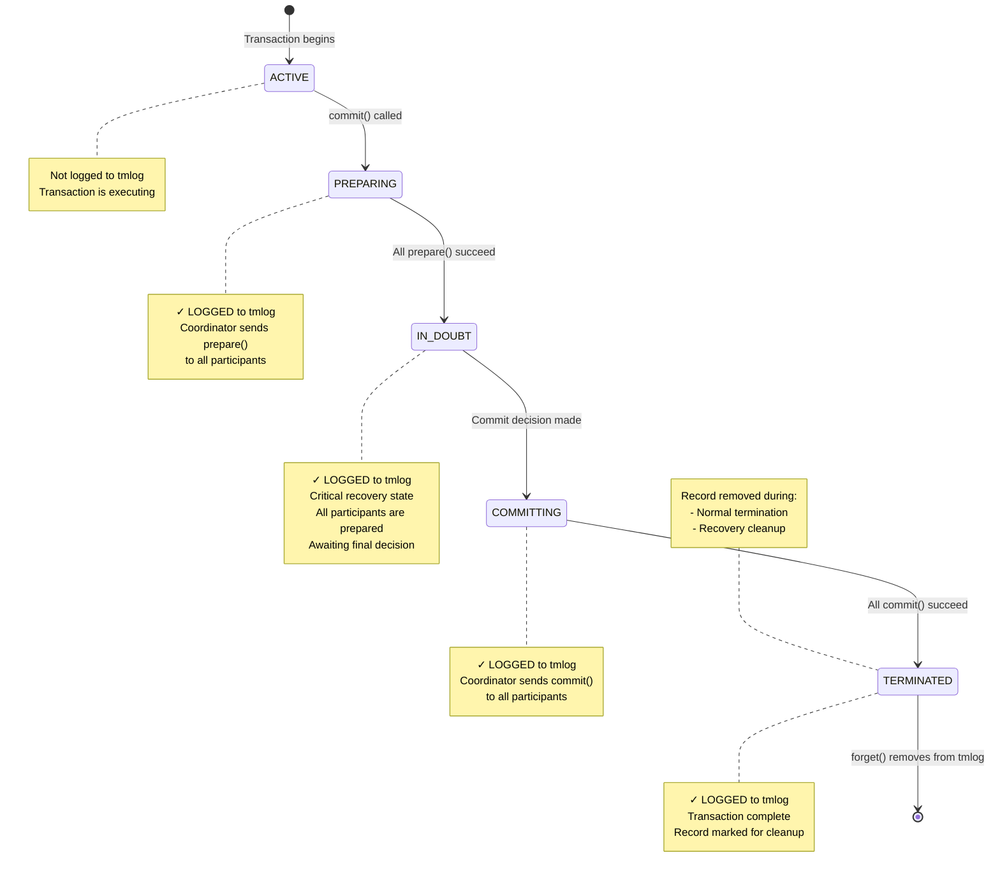
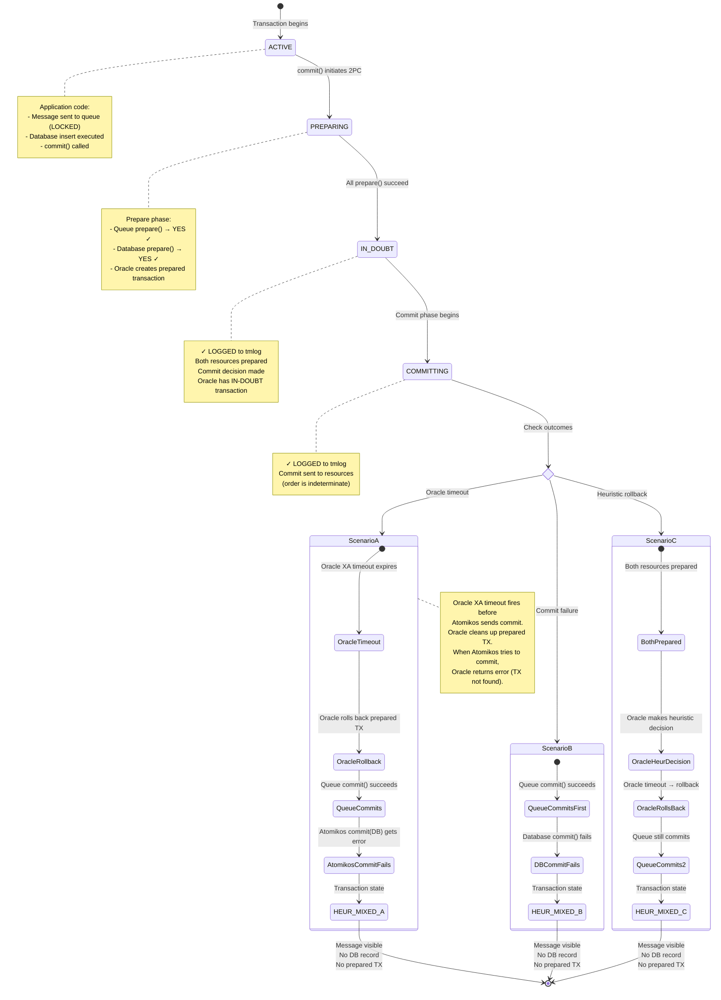

# Atomikos Transaction Log (tmlog) Research

This document provides a comprehensive analysis of how Atomikos uses its transaction log (tmlog) file, including transaction states, transitions, and behavior in various scenarios.

## Table of Contents
- [Overview](#overview)
- [When Transactions are Stored to tmlog](#when-transactions-are-stored-to-tmlog)
- [When Transactions are Removed from tmlog](#when-transactions-are-removed-from-tmlog)
- [Transaction States](#transaction-states)
- [Timeout Configuration and ABANDONED State](#timeout-configuration-and-abandoned-state)
- [Scenario 1: Successful Transaction](#scenario-1-successful-transaction)
- [Scenario 2: Commit Failure After Prepare Success](#scenario-2-commit-failure-after-prepare-success)
- [Scenario 3: Queue Succeeded, Database Failed, No Prepared Transaction](#scenario-3-queue-succeeded-database-failed-no-prepared-transaction)
- [Detailed Simulation: Queue Commits, DB Fails, Then DB Times Out](#detailed-simulation-queue-commits-db-fails-then-db-times-out)
- [Critical Question: Rollback After Prepare Success?](#critical-question-rollback-after-prepare-success)

---

## Overview

Atomikos uses a transaction log file (tmlog) to ensure ACID properties and enable recovery in case of system failures. The log follows the Two-Phase Commit (2PC) protocol and records transactions in **recoverable states** to ensure proper recovery.

### Key Components

- **StateRecoveryManagerImp**: Listens to FSM (Finite State Machine) state transitions and triggers logging
- **OltpLogImp**: Validates and persists transaction records to the repository
- **RecoveryLogImp**: Manages recovery operations and cleanup
- **RecoveryDomainService**: Performs periodic recovery scans for expired transactions

---

## When Transactions are Stored to tmlog

Transactions are written to the tmlog when they enter **recoverable states**. This happens through the following process:

1. **Trigger**: When a transaction coordinator transitions to a recoverable state
2. **States that trigger logging**:
   - `PREPARING` - Prepare phase in progress
   - `IN_DOUBT` - Waiting for commit/abort decision (most critical for recovery)
   - `COMMITTING` - Commit phase in progress
   - `ABORTING` - Rollback phase in progress
   - `HEUR_COMMITTED` - Heuristically committed
   - `HEUR_ABORTED` - Heuristically rolled back
   - `HEUR_MIXED` - Mixed outcome across participants
   - `HEUR_HAZARD` - Uncertain outcome

3. **Process Flow**:
   ```
   Coordinator enters recoverable state
   → StateRecoveryManagerImp.preEnter() is called
   → PendingTransactionRecord is created from coordinator state
   → OltpLogImp.write() persists the record to repository
   ```

4. **Non-recoverable states** (NOT logged):
   - `ACTIVE` - Transaction is running (not yet prepared)
   - `MARKED_ABORT` - Rollback-only flag set
   - `COMMITTED` - Successfully committed (terminal state, no recovery needed)
   - `ABORTED` - Rolled back (terminal state, no recovery needed)
   - `ABANDONED` - Timed out without resolution

**Implementation References**:
- `StateRecoveryManagerImp.java` (lines 34-51)
- `OltpLogImp.java` (line 48) - Validates recoverable states

---

## When Transactions are Removed from tmlog

Transactions are removed or marked as terminated in two scenarios:

### Scenario A: Normal Termination

When a transaction completes (successfully or with failure):

1. **Trigger**: Transaction reaches a final state
2. **Process**:
   ```
   RecoveryLogImp.forget(coordinatorId) is called
   → Record is marked as TERMINATED state
   → Record is updated in repository (state change, not deletion)
   ```

**Implementation Reference**: `RecoveryLogImp.java` (lines 98-102)

### Scenario B: Recovery Cleanup

During periodic recovery scans:

1. **Expired COMMITTING transactions**: Automatically forgotten after timeout
2. **Expired IN_DOUBT transactions**: Forgotten if beyond `maxTimeout`
3. **Foreign IN_DOUBT coordinators**: Forgotten for heuristic abort scenarios
4. **Process**:
   ```
   RecoveryDomainService performs periodic scans
   → Identifies expired transactions
   → Calls RecoveryLogImp.forgetTransactionRecords()
   → Removes all expired records from repository
   ```

**Implementation References**:
- `RecoveryLogImp.java` (lines 75-83)
- `RecoveryDomainService.java` (recovery logic)

---

## Transaction States

Atomikos defines transaction states in the `TxState` enum:

### Operational States (OLTP)
- **ACTIVE**: Transaction is running, no logging
- **MARKED_ABORT**: Rollback-only flag set
- **LOCALLY_DONE**: Preparation/termination phase
- **COMMITTED**: Successfully committed (terminal)
- **ABORTED**: Rolled back (terminal)
- **ABANDONED**: Timed out without resolution

### Recoverable States (Logged to tmlog)
- **PREPARING**: Prepare phase in progress
- **IN_DOUBT**: Waiting for commit/abort decision (critical!)
- **COMMITTING**: Commit phase in progress
- **ABORTING**: Rollback phase in progress

### Heuristic/Final States
- **HEUR_COMMITTED**: Heuristically committed
- **HEUR_ABORTED**: Heuristically rolled back
- **HEUR_MIXED**: Mixed outcome (some resources committed, others rolled back)
- **HEUR_HAZARD**: Uncertain outcome (need manual intervention)
- **TERMINATED**: Final cleanup marker

### State Transition Rules

From `TxState.java`, these transitions are enforced:

- **ACTIVE** → PREPARING, COMMITTING, ABORTING
- **PREPARING** → IN_DOUBT, ABORTING, TERMINATED, ABANDONED
- **IN_DOUBT** → ABORTING, COMMITTING, ABANDONED, TERMINATED
- **COMMITTING** → HEUR_ABORTED, HEUR_COMMITTED, HEUR_HAZARD, HEUR_MIXED, TERMINATED, ABANDONED
- **ABORTING** → HEUR_ABORTED, HEUR_COMMITTED, HEUR_HAZARD, HEUR_MIXED, TERMINATED, ABANDONED

---

## Timeout Configuration and ABANDONED State

### Overview of Atomikos Timeouts

Atomikos uses several timeout configurations that control transaction lifecycle, recovery, and cleanup. Understanding these timeouts is critical for diagnosing issues like orphaned transactions, heuristic outcomes, and database inconsistencies.

### Atomikos Timeout Properties

All timeout configurations are set in `transactions-defaults.properties` or programmatically via the TransactionManager API.

#### 1. `default_jta_timeout`

**Property**: `com.atomikos.icatch.default_jta_timeout`  
**Default**: `10000` ms (10 seconds)  
**Purpose**: The default timeout applied when a new transaction starts

**What it controls**:
- Maximum time a transaction can run from `begin()` to `commit()`/`rollback()`
- If exceeded, the transaction is automatically rolled back
- Applied to all transactions unless overridden

**How to override**:
```java
// Programmatically set timeout for next transaction
userTransaction.setTransactionTimeout(30); // 30 seconds

// Or via annotation (Spring/Jakarta EE)
@Transactional(timeout = 30)
public void myMethod() { ... }
```

**Implementation**: `TransactionManagerImp.java` line 99-102

#### 2. `max_timeout`

**Property**: `com.atomikos.icatch.max_timeout`  
**Default**: `300000` ms (5 minutes)  
**Purpose**: Maximum allowed timeout for any transaction in the system

**What it controls**:
- Acts as a ceiling for transaction timeout values
- If `setTransactionTimeout(n)` is called with `n > max_timeout`, the value is capped at `max_timeout`
- Prevents transactions from running indefinitely

**Relationship to default_jta_timeout**:
```
0 ≤ individual transaction timeout ≤ max_timeout
default_jta_timeout is the initial value if not explicitly set
```

**Implementation**: `TransactionServiceImp.java` line 237-240

#### 3. `recovery_delay`

**Property**: `com.atomikos.icatch.recovery_delay` (not explicitly in defaults, uses `default_jta_timeout`)  
**Default**: Same as `default_jta_timeout` (10 seconds)  
**Purpose**: Delay between recovery scans for in-doubt transactions

**What it controls**:
- How often the recovery service scans tmlog for transactions requiring recovery
- Shorter delays = faster recovery but higher CPU usage
- Longer delays = slower recovery but lower overhead

#### 4. `forget_orphaned_log_entries_delay`

**Property**: `com.atomikos.icatch.forget_orphaned_log_entries_delay`  
**Default**: `86400000` ms (24 hours)  
**Purpose**: Delay before removing orphaned log entries from tmlog

**What it controls**:
- How long Atomikos keeps log entries for ABANDONED and old TERMINATED transactions
- After this delay, entries are permanently removed from tmlog
- Prevents tmlog from growing indefinitely

**Implementation**: `CachedRepository.java` - removes entries where `(entry.expires + forget_orphaned_log_entries_delay) < currentTime`

### Oracle XA Timeout Configuration

Oracle has its own timeout settings that interact with Atomikos:

#### 1. Oracle Distributed Lock Timeout

**Parameter**: `distributed_lock_timeout`  
**Default**: `60` seconds  
**Purpose**: Maximum time Oracle keeps a prepared XA transaction before automatically rolling it back

**How to check**:
```sql
SELECT name, value FROM v$parameter 
WHERE name = 'distributed_lock_timeout';
```

**How to change**:
```sql
```sql
-- In Oracle (as DBA):
ALTER SYSTEM SET distributed_lock_timeout = 120 SCOPE=BOTH;
```

**CRITICAL CLARIFICATION**:
```
distributed_lock_timeout ONLY affects ACTIVE transactions waiting for locks.
It does NOT affect PREPARED transactions.

Prepared transactions in Oracle persist indefinitely regardless of this setting.
There is NO automatic timeout mechanism for prepared transactions in Oracle.
```

**Implication**: Since Oracle doesn't automatically timeout prepared transactions, misalignment with Atomikos timeouts is less of an issue than previously thought. However, manual monitoring and cleanup of orphaned prepared transactions becomes essential.

#### 2. Oracle XA Transaction Timeout (Set by Atomikos)

**How it works**: Atomikos calls `XAResource.setTransactionTimeout(seconds)` on Oracle XA resources when the resource is first used

**Atomikos Implementation** (in this repository):

In `XAResourceTransaction.java`:
```java
// Constructor: timeout is derived from the transaction timeout
this.timeout = (int) transaction.getTimeout() / 1000; // Convert ms to seconds

// Method setXAResource(): called when resource is first used
public void setXAResource(XAResource xaresource) {
    this.xaresource = xaresource;
    try {
        this.xaresource.setTransactionTimeout(this.timeout);
    } catch (XAException e) {
        // Warning logged but not considered fatal
    }
}
```

**When is it called?**:
- When the XA resource is first accessed in the transaction (before any work is done)
- Sets the timeout based on the transaction's configured timeout (`default_jta_timeout`)
- Called during the **ACTIVE** phase, before any prepare() calls

**What it does**:
- Sets timeout for **active transaction operations** (before prepare)
- Tells Oracle's XA driver how long to wait for operations during the active phase
- **Does NOT reliably timeout prepared transactions** in Oracle
- Oracle prepared transactions persist indefinitely regardless of this setting
- The timeout value comes from Atomikos transaction timeout, NOT from max_timeout

**Critical Limitation**: 
Once `xa_prepare()` succeeds and the transaction enters PREPARED state in Oracle, this timeout no longer applies. The prepared transaction will persist indefinitely until:
1. Commit/rollback is received
2. Manual DBA intervention (ROLLBACK FORCE)
3. Oracle instance restart
4. Session/connection termination (depending on configuration)

### ABANDONED State

#### What is ABANDONED?

**ABANDONED** is a transaction state indicating that a transaction exceeded `max_timeout` without completing, even in recovery states.

**Legal transitions TO ABANDONED**:
- PREPARING → ABANDONED
- IN_DOUBT → ABANDONED  
- COMMITTING → ABANDONED
- ABORTING → ABANDONED

#### When Does a Transaction Enter ABANDONED?

A transaction enters ABANDONED state when:

1. **Timeout in recoverable state**: Transaction is in PREPARING, IN_DOUBT, COMMITTING, or ABORTING state
2. **Max timeout exceeded**: The transaction has been in that state longer than `max_timeout`
3. **Recovery attempts exhausted**: Recovery service has tried to complete the transaction but failed

**Example timeline**:
```
T=0s:      Transaction starts
T=5s:      commit() called, enters PREPARING
T=6s:      prepare() succeeds on all resources, enters IN_DOUBT
T=7s:      COMMITTING state begins
T=10s:     Commit fails on database, enters HEUR_HAZARD
T=310s:    max_timeout (300s) exceeded
T=310s:    Transaction moves to ABANDONED state
```

**Implementation**: `CoordinatorStateHandler.java` lines 634-638:
```java
private void removePendingOltpCoordinatorFromTransactionService() {
    coordinator.setState(TxState.ABANDONED);
    coordinator.dispose();
    LOGGER.logWarning("Abandoning " + coordinator.getCoordinatorId() + 
        " in state " + state + " after timeout - recovery will cleanup in the background");
}
```

#### Is ABANDONED Logged to tmlog?

**NO** - ABANDONED is **NOT a recoverable state**. From the code analysis:

**Non-recoverable states** (never logged to tmlog):
- ACTIVE
- MARKED_ABORT
- COMMITTED
- ABORTED
- **ABANDONED** ← Not logged

When a transaction transitions to ABANDONED:
1. The coordinator is disposed (all resources released)
2. The state is set to ABANDONED locally
3. **No tmlog write occurs** for the ABANDONED state itself

However, the transaction may have been logged in a previous recoverable state (PREPARING, IN_DOUBT, COMMITTING, ABORTING) before transitioning to ABANDONED.

#### Is ABANDONED Eventually Removed from tmlog?

**YES** - Indirectly, via the cleanup mechanism for orphaned entries.

**The cleanup process**:

1. **Last logged state**: Before ABANDONED, the transaction was in a recoverable state (e.g., IN_DOUBT, HEUR_HAZARD) and was logged to tmlog

2. **Transition to ABANDONED**: When max_timeout is exceeded, the transaction moves to ABANDONED state locally (in memory), but this state change is NOT written to tmlog

3. **tmlog entry becomes orphaned**: The tmlog still has the old recoverable state entry (e.g., IN_DOUBT from T=6s), but the in-memory coordinator is now ABANDONED

4. **Expiry calculation**: Each tmlog entry has an expiry timestamp:
   ```
   entry.expires = entry.timestamp + transaction.timeout
   ```

5. **Orphaned entry removal**: After `forget_orphaned_log_entries_delay` (default 24 hours), the entry is removed:
   ```
   if (currentTime > entry.expires + forget_orphaned_log_entries_delay) {
       remove entry from tmlog
   }
   ```

**Timeline example**:
```
T=0s:      Transaction starts (timeout = 300s)
T=6s:      IN_DOUBT state, logged to tmlog with expires = T+300s = 306s
T=310s:    max_timeout exceeded, moves to ABANDONED (not logged)
T=306s:    tmlog entry "expires" timestamp passes
T=86706s:  forget_orphaned_log_entries_delay (24h) expires
T=86706s:  Recovery service removes the orphaned IN_DOUBT entry from tmlog
```

**Implementation**: `CachedRepository.java` cleanup logic removes entries based on:
```java
if (now > coordinatorLogEntry.expires + forgetOrphanedLogEntriesDelay) {
    repository.remove(coordinatorLogEntry);
}
```

### Timeout Interaction Summary

#### Scenario: Atomikos timeout < Oracle timeout

**Configuration**:
- Atomikos: `default_jta_timeout = 10s`, `max_timeout = 300s`
- Oracle: `distributed_lock_timeout = 60s`

**What happens**:
1. Transaction starts, runs for 8 seconds
2. `commit()` called at T=8s (2s before Atomikos timeout)
3. Both resources prepare successfully, IN_DOUBT state at T=8.5s
4. Atomikos attempts to send commit but experiences network delay
5. At T=18s, Atomikos transaction timeout (10s) expires
6. Atomikos marks transaction as timed out, but it's already in IN_DOUBT (cannot rollback)
7. Recovery attempts continue until T=308s (max_timeout)
8. At T=308s, transaction moves to ABANDONED state
9. At T=68.5s, Oracle's 60-second timeout expires, Oracle rolls back prepared transaction
10. Later, when Atomikos retry finally reaches Oracle: "transaction not found" error
11. Result: HEUR_MIXED state (if queue already committed)

**Problem**: Atomikos timeout doesn't prevent Oracle from making a heuristic decision.

#### Scenario: Oracle timeout < Atomikos timeout (DANGEROUS)

**Configuration**:
- Atomikos: `default_jta_timeout = 120s`, `max_timeout = 300s`  
- Oracle: `distributed_lock_timeout = 60s`

**What happens**:
1. Transaction prepares successfully on both resources at T=5s
2. IN_DOUBT state reached, commit decision made
3. Delay occurs before commit messages are sent (network lag, GC pause, etc.)
4. At T=65s, Oracle timeout (60s) expires **before** Atomikos sends commit
5. Oracle automatically rolls back the prepared transaction
6. At T=70s, Atomikos sends commit to both resources:
   - Queue commits successfully → message becomes visible
   - Oracle returns error: "ORA-24756: transaction does not exist"
7. Result: HEUR_MIXED state - queue committed, database rolled back

**Problem**: Oracle heuristically decides to rollback before Atomikos can execute its commit decision.

### Best Practices for Timeout Configuration

1. **Oracle timeout > Atomikos max_timeout**:
   ```properties
   # Atomikos
   com.atomikos.icatch.max_timeout=300000  # 5 minutes
   
   # Oracle
   distributed_lock_timeout=360  # 6 minutes
   ```

2. **Short default timeout, higher max**:
   ```properties
   com.atomikos.icatch.default_jta_timeout=30000    # 30 seconds (most transactions)
   com.atomikos.icatch.max_timeout=300000            # 5 minutes (for long-running)
   ```

3. **Monitor transaction duration**:
   - Alert if transactions approach timeout threshold
   - Log prepare-to-commit duration
   - Track ABANDONED transactions

4. **Tune forget_orphaned_log_entries_delay based on retention needs**:
   ```properties
   # Keep orphaned entries for 7 days for forensics
   com.atomikos.icatch.forget_orphaned_log_entries_delay=604800000
   ```

5. **Consider single-threaded 2PC** to control commit order:
   ```properties
   com.atomikos.icatch.single_threaded_2pc=true
   ```

---

## Scenario 1: Successful Transaction

This diagram shows a typical successful 2PC transaction with two participants (e.g., Database and Queue Manager).



### Detailed Flow for Successful Transaction:

1. **ACTIVE** (not logged): Transaction starts, application executes business logic
2. **PREPARING** (logged): 
   - Transaction manager calls `prepare()` on Database participant → Vote: YES
   - Transaction manager calls `prepare()` on Queue Manager participant → Vote: YES
3. **IN_DOUBT** (logged): 
   - All participants voted YES
   - Coordinator makes COMMIT decision
   - Critical state: if crash occurs here, recovery will commit
4. **COMMITTING** (logged):
   - Coordinator calls `commit()` on Database → SUCCESS
   - Coordinator calls `commit()` on Queue Manager → SUCCESS
5. **TERMINATED** (logged):
   - All resources committed successfully
   - Record marked as TERMINATED
6. **Removed from tmlog**: `forget()` is called, record is removed

---

## Scenario 2: Commit Failure After Prepare Success

This diagram shows what happens when prepare succeeds on all participants, but commit fails on one resource (Database) after succeeding on another (Queue Manager).


### Detailed Flow for Failed Commit Scenario:

1. **ACTIVE** (not logged): Transaction starts normally
2. **PREPARING** (logged):
   - `prepare()` on Database → Vote: YES ✓
   - `prepare()` on Queue Manager → Vote: YES ✓
3. **IN_DOUBT** (logged):
   - All participants prepared successfully
   - Coordinator makes COMMIT decision (cannot be changed!)
4. **COMMITTING** (logged):
   - `commit()` on Queue Manager → SUCCESS ✓
   - `commit()` on Database → **EXCEPTION** ✗
   - Exception wrapped as `HeurHazardException` (CommitMessage.java, lines 54-67)
5. **HEUR_HAZARD** (logged):
   - Transaction enters heuristic hazard state
   - Queue Manager has committed (cannot be undone)
   - Database outcome is unknown
   - Retry flag is set for recovery attempts
6. **Recovery Attempts**:
   - Recovery service periodically scans for expired COMMITTING/HEUR_HAZARD transactions
   - Attempts to retry commit on Database
   - Three possible outcomes:
     - **Success** → TERMINATED (Database eventually commits)
     - **Permanent Failure** → HEUR_MIXED (Database rolled back, Queue Manager committed)
     - **Timeout** → ABANDONED (maxTimeout exceeded, needs manual intervention)

---

## Critical Question: Rollback After Prepare Success?

### ❌ NO - Atomikos Will NOT Send a Rollback

**Question**: In the scenario where prepare succeeds but commit fails on the database (after succeeding on queue manager), will Atomikos send a rollback to the database resource after prepare succeeded and commit failed?

**Answer**: **NO, Atomikos will NOT automatically send a rollback to the database.**

### Why No Rollback?

Once a transaction enters the **IN_DOUBT** state (after all participants vote YES during prepare), the coordinator makes an **irrevocable COMMIT decision**. According to the Two-Phase Commit protocol:

1. **Prepare Phase**: All participants vote YES or NO
   - If any participant votes NO → coordinator decides ROLLBACK
   - If all participants vote YES → coordinator decides **COMMIT** (cannot change!)

2. **Commit Phase**: Coordinator executes the decision
   - The decision is **durably logged** (IN_DOUBT → COMMITTING state)
   - The decision cannot be reversed, even if commit fails on some participants

### What Actually Happens?

When commit fails on Database after succeeding on Queue Manager:

1. **No Rollback Sent**: The Database is NOT told to rollback
2. **Heuristic State**: Transaction enters `HEUR_HAZARD` or `HEUR_MIXED` state
3. **Recovery Retries**: Recovery service attempts to retry commit on Database
4. **Possible Outcomes**:
   - **Database eventually commits** → Consistent state reached
   - **Database rolled back** → `HEUR_MIXED` state (inconsistent!)
   - **Database remains in-doubt** → `HEUR_HAZARD` state (manual intervention needed)

### Code Evidence

From `CommitMessage.java` (lines 54-67):
```java
// When commit throws ANY exception (except heuristic exceptions):
// It wraps it as HeurHazardException with retry=true
// Transaction enters HEUR_HAZARD state, NOT rolled back
```

From `TxState.java`:
```java
// Legal transitions from COMMITTING state:
COMMITTING → HEUR_ABORTED, HEUR_COMMITTED, HEUR_HAZARD, HEUR_MIXED, 
             TERMINATED, ABANDONED
// Note: ABORTING is NOT a legal transition from COMMITTING
```

From `IndoubtStateHandler.java` and `HeurHazardStateHandler.java`:
- Recovery logic attempts to **replay the commit decision**
- If Database times out, it may perform **heuristic abort** (Database's decision, not coordinator's)
- Coordinator never sends explicit rollback after IN_DOUBT state

### Summary

Once the coordinator makes a COMMIT decision (after successful prepare), it is **committed to committing**. If a participant fails during commit:

- ✓ Coordinator will **retry commit** during recovery
- ✓ Transaction enters **heuristic state** if outcome is uncertain
- ✗ Coordinator will **NOT send rollback** to prepared participants
- ⚠️ **Inconsistent state possible** (HEUR_MIXED) requiring manual intervention

This behavior ensures that the transaction manager adheres to the Two-Phase Commit protocol's durability guarantees while exposing the inherent risk of heuristic outcomes when commit failures occur.

---

## Implementation References

Key source files analyzed:

- `TxState.java` - State definitions and transition rules
- `StateRecoveryManagerImp.java` - Triggers logging on state entry (lines 34-51)
- `OltpLogImp.java` - Validates and persists records (line 48)
- `RecoveryLogImp.java` - Recovery and cleanup operations (lines 75-102)
- `RecoveryDomainService.java` - Periodic recovery scans
- `CommitMessage.java` - Commit phase implementation (lines 54-67)
- `TerminationResult.java` - Heuristic outcome detection (lines 111-117)
- `HeurHazardStateHandler.java` - Handles HEUR_HAZARD state
- `HeurMixedStateHandler.java` - Handles HEUR_MIXED state
- `IndoubtStateHandler.java` - Handles IN_DOUBT state and timeout

---

## Conclusion

Atomikos' tmlog file is a critical component for ensuring transaction durability and recovery. Key takeaways:

1. **Only recoverable states are logged** (PREPARING, IN_DOUBT, COMMITTING, ABORTING, HEUR_*)
2. **IN_DOUBT state is the most critical** - it represents the point of no return for commit decision
3. **Recovery is retry-based** - The system attempts to complete the original decision, not reverse it
4. **Heuristic outcomes are possible** - When participants cannot be reached or fail, manual intervention may be needed
5. **No automatic rollback after prepare** - Once committed to commit, the system tries to commit, not rollback

This design ensures ACID properties while exposing the fundamental limitations of distributed transactions.

---


## Scenario 3: Queue Succeeded, Database Failed, No Prepared Transaction

### Real-World Problem

A common scenario encountered in production:
- **Message appeared in the queue** (visible to consumers)
- **Record did NOT appear in database** (failed)
- **Oracle DBA found NO prepared transactions** in the database
- **tmlog files were not available** for inspection at the time of the issue

**Question**: What is the most likely explanation for this scenario? Could the transaction have timed out and been rolled back?

### Answer: Oracle Prepared Transaction Timeout or Commit Phase Failure

**Important Clarification**: Since the message **is visible in the queue**, this means the queue resource **successfully committed**. In XA transactions, messages are locked and invisible until commit succeeds. Therefore, prepare must have succeeded on both resources, and the commit phase must have started.

**Most Likely Scenarios** (in order of probability):

1. **Oracle prepared transaction timed out** before Atomikos could commit it
2. **Commit phase failed on database** after succeeding on queue
3. **Oracle heuristically rolled back** the prepared transaction

### Why This Happens

#### Understanding XA Transaction Flow

**Critical Fact**: In JMS/XA transactions, messages are sent during application code but remain **invisible** (locked) until the transaction commits. The message only becomes visible to consumers after a successful commit.

```
Application Code:
  producer.send(message)  ← Message sent but LOCKED in queue
  dao.insert(record)       ← Database operation executed
  
Transaction Commit:
  prepare(queue)    → Vote: YES  (message still locked)
  prepare(database) → Vote: YES  (DB in prepared state)
  [IN_DOUBT state reached - logged to tmlog]
  
  commit(queue)     → SUCCESS ✓ (message now VISIBLE)
  commit(database)  → ??? 
```

Since the message **is visible**, we know:
- Prepare succeeded on both resources
- IN_DOUBT state was reached
- Commit was sent to queue and succeeded
- Something went wrong with the database commit

#### Timeline of Events:



### Detailed Scenarios

#### Scenario A: Oracle XA Prepared Transaction Timeout (Most Likely)

**What Happened**:
1. Transaction starts, message sent (locked), database operation executed
2. `commit()` called, both resources prepare successfully
3. Oracle creates a prepared XA transaction with timeout (default from Atomikos)
4. Transaction enters IN_DOUBT state, logged to tmlog
5. **Delay occurs** before commit phase (network issue, system load, GC pause)
6. **Oracle's XA timeout expires** (typically 60 seconds default)
7. **Oracle automatically rolls back** the prepared transaction to free resources
8. Oracle removes the in-doubt transaction from its internal tables
9. Atomikos finally sends commit to both resources:
   - Queue commits successfully → **message becomes visible**
   - Database commit fails with "transaction not found" or similar error
10. Atomikos enters HEUR_HAZARD or HEUR_MIXED state

**Why Oracle Shows No Prepared Transaction**:
- Oracle had a prepared transaction but its timeout expired
- Oracle's automatic cleanup rolled it back
- By the time the DBA checked (days later), the transaction was long gone

**Evidence to Look For**:
- Oracle alert logs: `ORA-24756: transaction does not exist`
- Atomikos logs: `HeurHazardException` or `HeurMixedException` 
- Check if Atomikos transaction timeout > Oracle XA timeout

**Oracle XA Timeout Configuration**:
```sql
-- Check Oracle XA transaction timeout (default 60 seconds)
SELECT name, value FROM v$parameter WHERE name = 'distributed_lock_timeout';

-- Check for timed-out distributed transactions
SELECT * FROM dba_2pc_pending WHERE state = 'forced rollback';
```

#### Scenario B: Commit Phase Failure After Partial Success

**What Happened**:
1. Both resources prepare successfully
2. Transaction enters IN_DOUBT state
3. Atomikos sends commit to both resources (order is indeterminate)
4. **Queue commits first** → message becomes visible
5. **Database commit fails**:
   - Connection lost during commit
   - Database crashed between prepare and commit
   - Network partition
   - Oracle instance failure
6. Atomikos receives success from queue, failure from database
7. Transaction enters HEUR_MIXED state

**Why Oracle Shows No Prepared Transaction**:
- If Oracle crashed, prepared transactions are rolled back on restart
- If connection was lost, Oracle may have cleaned up the XA transaction
- The prepared state doesn't persist across Oracle instance restarts without proper configuration

**Evidence to Look For**:
- Atomikos logs: `HeurMixedException` with details about which resource failed
- Oracle alert logs: Instance crash or connection errors
- Network logs: Connection failures during commit window

#### Scenario C: Oracle Heuristic Rollback Decision

**What Happened**:
1. Both resources prepare successfully
2. Transaction enters IN_DOUBT state
3. Before Atomikos sends commit, Oracle's resource manager makes a **heuristic decision**
4. Oracle times out and decides to rollback the prepared transaction
5. Queue receives commit and succeeds
6. Database returns `XA_HEURRB` (heuristic rollback)
7. Transaction enters HEUR_MIXED state

**Why Oracle Shows No Prepared Transaction**:
- Oracle decided to rollback before receiving commit instruction
- Prepared transaction was removed by Oracle's heuristic decision

**Evidence to Look For**:
- Atomikos logs: `XAException` with error code `XA_HEURRB` (heuristic rollback)
- Oracle logs: Heuristic rollback decision logged

### Key Findings

#### Why The Message Is Visible

**Critical Point**: The fact that the message is visible in the queue proves that:
1. The queue resource **successfully committed**
2. The prepare phase **succeeded on both resources** (otherwise queue would have rolled back)
3. The transaction **reached IN_DOUBT state** (both voted YES)
4. The commit phase **was initiated and succeeded on the queue**

This completely rules out the theory that prepare failed on the database.

#### Why Oracle Shows No Prepared Transaction

Possible reasons:
1. **Timeout expiry**: Oracle's XA timeout expired and Oracle rolled back automatically
2. **Crash recovery**: Oracle instance crashed and rolled back prepared transactions on restart
3. **Heuristic decision**: Oracle's XA resource manager decided to rollback due to timeout
4. **Manual intervention**: DBA manually rolled back the prepared transaction
5. **Connection cleanup**: Lost connection caused Oracle to cleanup the XA transaction

#### Atomikos tmlog State

Without the tmlog files, we can't know for certain, but the transaction likely:
- Was logged in IN_DOUBT or COMMITTING state
- Later transitioned to HEUR_MIXED or HEUR_HAZARD state
- Eventually was marked as TERMINATED or ABANDONED after timeout
- Log entry may have been cleaned up days later by recovery service

### Timeout Configuration Analysis

#### Atomikos Transaction Timeout

From `transactions-defaults.properties`:
```properties
com.atomikos.icatch.default_jta_timeout=10000    # 10 seconds
com.atomikos.icatch.max_timeout=300000            # 5 minutes
```

This timeout is set on XA resources via `XAResource.setTransactionTimeout()`, but primarily affects **active transaction operations**, not prepared transactions.

#### Oracle XA Transaction Timeout

**CRITICAL**: Oracle has **NO standard automatic timeout for prepared transactions**:
```sql
-- distributed_lock_timeout only affects ACTIVE transactions waiting for locks
-- It does NOT affect PREPARED transactions
distributed_lock_timeout = 60  -- Does NOT timeout prepared TXs

-- Prepared transactions persist indefinitely until:
-- 1. Commit/rollback received
-- 2. Manual DBA intervention (ROLLBACK FORCE)
-- 3. Instance restart
-- 4. Session/connection termination (depending on configuration)
```

#### Why Prepared Transactions Might Disappear

Since Oracle doesn't automatically timeout prepared transactions, if one disappears, it's due to:

1. **Manual DBA Intervention**: Most common cause
   ```sql
   -- DBA manually cleans up orphaned prepared transaction
   ROLLBACK FORCE 'transaction_id';
   -- OR
   EXECUTE DBMS_TRANSACTION.PURGE_LOST_DB_ENTRY('transaction_id');
   ```

2. **Instance Restart/Crash**: Prepared transactions may require manual resolution after restart

3. **Session Termination**: If the session/connection that created the prepared transaction is terminated, Oracle may clean it up

4. **Heuristic Decision**: In rare cases with extended network partitions, Oracle may make a heuristic decision

### Diagnostics and Prevention

#### To Diagnose Root Cause:

1. **Check Atomikos logs** for:
   ```
   HeurMixedException
   HeurHazardException  
   XAException with error codes:
   - XA_HEURRB (heuristic rollback)
   - XA_HEURMIX (heuristic mixed)
   - XAER_NOTA (transaction not found)
   ```

2. **Check Oracle alert logs** for:
   ```
   ORA-24756: transaction does not exist
   ORA-02051: another session  in same transaction failed
   Distributed transaction timeout
   Instance crash/restart during the time window
   ```

3. **Check Oracle DBA_2PC_PENDING**:
   ```sql
   SELECT local_tran_id, state, tran_comment, fail_time, commit#
   FROM dba_2pc_pending
   WHERE fail_time BETWEEN <incident_start> AND <incident_end>;
   ```

4. **Check for GC pauses or system delays**:
   - JVM garbage collection logs
   - System load at the time of incident
   - Network latency monitoring

#### To Prevent This Issue:

1. **Align timeouts properly**:
   ```properties
   # Increase Atomikos timeout to allow for delays
   com.atomikos.icatch.default_jta_timeout=30000  # 30 seconds
   
   # Ensure Oracle timeout > Atomikos timeout
   # In Oracle: ALTER SYSTEM SET distributed_lock_timeout = 120;
   ```

2. **Enable single-threaded 2PC** (for consistent commit ordering):
   ```properties
   com.atomikos.icatch.single_threaded_2pc=true
   ```
   This ensures queue doesn't commit before database.

3. **Monitor transaction duration**:
   - Alert if time between prepare and commit exceeds threshold
   - Log slow transactions
   - Monitor queue and database latency separately

4. **Implement idempotent message consumers**:
   - Always check if database record exists before processing message
   - Use unique message IDs to detect duplicates
   - Handle "message without database record" gracefully

5. **Enable Oracle Distributed Transaction Recovery**:
   ```sql
   -- Configure pending transaction resolution
   ALTER SYSTEM SET distributed_recovery_connection_hold_time = 200;
   ```

6. **Use tmlog archiving**:
   - Configure Atomikos to archive tmlog files
   - Retain logs for analysis
   - Monitor for HEUR_MIXED transactions

### Summary for Your Specific Scenario

**What Most Likely Happened**:

Since the message **is visible in the queue**, this proves:
- Both prepare() calls succeeded
- Transaction reached IN_DOUBT state
- Queue commit() succeeded
- Database commit() either:
  a) Never was called due to crash
  b) Was called but transaction had already timed out in Oracle
  c) Failed due to connection/network issue

**Why Oracle shows no prepared transaction**:
- The prepared transaction existed temporarily after prepare succeeded
- Oracle's timeout (60s default) expired before Atomikos sent the commit
- Oracle automatically rolled back the prepared transaction
- By the time DBA checked days later, Oracle had cleaned up all trace of it

**Why the message persists**:
- Queue committed successfully in the commit phase
- This is a **HEUR_MIXED state** - different outcomes for different resources
- This is the inherent risk of distributed transactions

**Could this have been prevented?**:
- YES - by ensuring Oracle's XA timeout > Atomikos transaction timeout
- YES - by using single-threaded 2PC to control commit order
- YES - by monitoring and alerting on slow transaction phases
- PARTIAL - by implementing idempotent consumers to handle orphaned messages

**Conclusion**: This is **not a prepare phase failure** but rather a **commit phase timing issue** where Oracle's prepared transaction timed out before Atomikos could complete the commit phase. The queue committed successfully but the database had already cleaned up its prepared state, resulting in a heuristic mixed outcome.

---

## Detailed Simulation: Queue Commits, DB Fails, Then DB Times Out

### Scenario Setup

This simulation walks through the exact scenario requested: both prepare succeed, queue commits successfully, database commit fails, then the prepared transaction disappears from Oracle before Atomikos can retry.

**Configuration** (based on actual production environment):
- Atomikos `default_jta_timeout`: 40,000 ms (40 seconds) - **explicitly set**
- Atomikos `max_timeout`: 40,000 ms (40 seconds) - **explicitly set** (unusual: typically max > default)
- Oracle `distributed_lock_timeout`: 150 seconds - **DOES NOT affect PREPARED transactions**
- Atomikos recovery scan interval (`recovery_delay`): 60 seconds
- Atomikos `forget_orphaned_log_entries_delay`: 86,400,000 ms (24 hours) - **default**

**Critical Clarification about Oracle distributed_lock_timeout**:
- This timeout applies to **active transactions** waiting for locks
- Once a transaction is **PREPARED** (XA prepared state), `distributed_lock_timeout` no longer applies
- Prepared transactions in Oracle are controlled by different mechanisms (discussed below)

**Key Configuration Observations**:
- `max_timeout` = `default_jta_timeout` (40s) - This is unusual; typically max_timeout >> default
- Recovery delay (60s) > transaction timeout (40s) - First recovery attempt happens AFTER transaction has already timed out
- This configuration creates a critical timing gap

**Timeline**: T=0 is when the transaction begins

### Step-by-Step Timeline

#### Phase 1: Transaction Execution (T=0s to T=5s)

**T=0s: Transaction Begins**
```
TransactionManager.begin()
- Transaction ID: TX-12345
- Timeout: 40 seconds (default_jta_timeout)
- State: ACTIVE
- tmlog: NOT logged (ACTIVE is not recoverable)
```

**T=1s: Queue Operation**
```
producer.send(message)
- Message sent to queue manager
- Message is LOCKED (not visible to consumers)
- Queue XA resource enlisted in transaction
- State: Still ACTIVE
- tmlog: NOT logged
```

**T=2s: Database Operation**
```
dao.insert(record)
- SQL executed, data in Oracle's undo tablespace
- Database XA resource enlisted in transaction
- State: Still ACTIVE
- tmlog: NOT logged
```

**T=5s: Application Calls commit()**
```
userTransaction.commit()
- Atomikos coordinator initiates 2PC
- State: Transitions to PREPARING
- tmlog: Entry written for PREPARING state
```

#### Phase 2: Prepare Phase (T=5s to T=6s)

**T=5.2s: Prepare Queue**
```
coordinator.prepare(queueXAResource)
- Call: queueXAResource.prepare(xid)
- Queue validates transaction
- Queue locks message (still invisible)
- Response: XA_OK (vote YES)
- Duration: 200ms
```

**T=5.5s: Prepare Database**
```
coordinator.prepare(databaseXAResource)
- Call: databaseXAResource.prepare(xid)
- Oracle validates transaction
- Oracle creates prepared transaction entry
- Oracle starts 60-second timeout clock
- Response: XA_OK (vote YES)
- Duration: 300ms
```

**T=6s: All Prepares Succeed**
```
Both participants voted YES
- State: Transitions to IN_DOUBT
- tmlog: Entry UPDATED to IN_DOUBT state
- Coordinator makes COMMIT decision (irrevocable)
- This decision is durable (logged)
```

**tmlog entry at T=6s**:
```
{
  "transactionId": "TX-12345",
  "state": "IN_DOUBT",
  "participants": [
    {"resourceName": "QueueManager", "branch": "XID-Q-12345", "state": "PREPARED"},
    {"resourceName": "OracleDB", "branch": "XID-DB-12345", "state": "PREPARED"}
  ],
  "timestamp": T=6s,
  "expires": T=46s  // T + 40s timeout
}
```

**Oracle internal state at T=6s**:
```sql
SELECT local_tran_id, state, fail_time 
FROM dba_2pc_pending 
WHERE local_tran_id = 'XID-DB-12345';

-- Result:
-- local_tran_id: XID-DB-12345
-- state: prepared
-- fail_time: NULL  
-- NOTE: distributed_lock_timeout (150s) does NOT apply to PREPARED transactions
-- Prepared transactions remain indefinitely until commit/rollback or manual intervention
```

#### Phase 3: Commit Phase Begins (T=6s to T=7s)

**T=6s: Coordinator Transitions to COMMITTING**
```
State: IN_DOUBT → COMMITTING
- tmlog: Entry UPDATED to COMMITTING state
- Coordinator begins sending commit messages
```

**tmlog entry at T=6s**:
```
{
  "transactionId": "TX-12345",
  "state": "COMMITTING",
  "participants": [
    {"resourceName": "QueueManager", "branch": "XID-Q-12345", "state": "PREPARED"},
    {"resourceName": "OracleDB", "branch": "XID-DB-12345", "state": "PREPARED"}
  ],
  "timestamp": T=6s,
  "expires": T=46s
}
```

**T=6.5s: Queue Commit Succeeds**
```
coordinator.commit(queueXAResource)
- Call: queueXAResource.commit(xid, false)
- Queue commits the message
- Message becomes VISIBLE to consumers
- Response: SUCCESS
- Duration: 500ms
```

**T=7s: Database Commit Fails**
```
coordinator.commit(databaseXAResource)
- Call: databaseXAResource.commit(xid, false)
- Network timeout / connection failure
- Oracle does NOT receive commit
- Response: XAException - connection error
- Duration: 500ms (timeout waiting for response)
```

#### Phase 4: Heuristic State and Critical Timing Gap (T=7s to T=67s)

**T=7s: Commit Failure Detected**
```
TerminationResult detects mixed outcome:
- Queue: COMMITTED (success)
- Database: UNKNOWN (failed to commit)

State: COMMITTING → HEUR_HAZARD
- tmlog: Entry UPDATED to HEUR_HAZARD state
- Recovery will retry database commit
```

**tmlog entry at T=7s**:
```
{
  "transactionId": "TX-12345",
  "state": "HEUR_HAZARD",
  "participants": [
    {"resourceName": "QueueManager", "branch": "XID-Q-12345", "state": "COMMITTED"},
    {"resourceName": "OracleDB", "branch": "XID-DB-12345", "state": "PREPARED", "retry": true}
  ],
  "timestamp": T=7s,
  "expires": T=47s
}
```

**Atomikos logs at T=7s**:
```
WARN: Transaction TX-12345 entered HEUR_HAZARD state
INFO: Queue committed successfully
ERROR: Database commit failed with connection error
INFO: Will retry database commit during recovery
```

**CRITICAL TIMING GAP: T=7s to T=67s (60 seconds)**
```
Recovery delay is 60 seconds
- NO recovery attempts happen between T=7s and T=67s
- Atomikos waits 60 seconds before first recovery scan
- During this entire period:
  * Transaction is in HEUR_HAZARD state
  * Oracle has prepared transaction (state: prepared)
  * Queue message is visible (already committed)
  * Database connection issue persists
  * NO retry attempts are made
```

**Oracle state during gap (T=7s to T=67s)**:
```sql
-- Oracle query shows:
SELECT local_tran_id, state FROM dba_2pc_pending 
WHERE local_tran_id = 'XID-DB-12345';

-- Result throughout this period:
-- local_tran_id: XID-DB-12345
-- state: prepared
-- NOTE: Prepared transaction remains indefinitely
-- distributed_lock_timeout does NOT cause rollback of prepared transactions
```

**T=40s: Transaction Timeout Exceeded**
```
Transaction has been running for 40 seconds
- Original timeout (default_jta_timeout = 40s) has expired
- But transaction is in HEUR_HAZARD (recoverable state)
- Transaction continues, waiting for recovery
- No action taken at this point
```

**T=46s: tmlog Entry Expires**
```
tmlog entry expires timestamp reached (T=46s)
- Entry.expires = T + 40s = 46s
- Entry is now "expired" but still in tmlog
- Recovery will still process it
- Eventually subject to forget_orphaned_log_entries_delay cleanup
```

**T=67s: FIRST Recovery Attempt**
```
Recovery service scans tmlog (first scan after 60 second delay)
- Finds TX-12345 in HEUR_HAZARD state
- Transaction has exceeded both timeouts (40s transaction, 46s expires)
- But max_timeout (40s) has been exceeded at T=40s
- Attempts to retry commit on database
- Call: databaseXAResource.commit(xid, false)
- Still cannot connect / times out
- Response: XAException - connection error
- State: Remains HEUR_HAZARD

**CRITICAL**: This is the ONLY retry attempt that will happen
Because max_timeout (40s) was exceeded at T=40s
```

#### Phase 5: The Mystery - How Did Oracle Prepared Transaction Disappear?

**CRITICAL QUESTION**: Oracle's `distributed_lock_timeout` does NOT affect prepared transactions. So how did the prepared transaction disappear from Oracle?

**Possible Explanations**:

**Explanation 1: Manual DBA Intervention (Most Likely)**
```
DBA manually rolled back the prepared transaction:

-- DBA identifies orphaned prepared transaction
SELECT * FROM dba_2pc_pending WHERE state = 'prepared';

-- DBA manually forces rollback
EXECUTE dbms_transaction.purge_lost_db_entry('XID-DB-12345');
-- OR
ROLLBACK FORCE 'XID-DB-12345';

This explains:
- Why Oracle shows no prepared transaction when checked later
- Why the transaction disappeared even though distributed_lock_timeout doesn't apply
- This is common practice for cleaning up orphaned distributed transactions
```

**Explanation 2: Oracle Instance Restart/Crash**
```
If Oracle instance restarted between T=6s and investigation:
- Prepared transactions may be rolled back on restart (depending on configuration)
- Or marked as "in-doubt" requiring manual resolution
- DBA_2PC_PENDING would be empty after cleanup

Evidence to look for:
- Oracle alert log showing instance restart
- Check v$log_history for gaps indicating restart
```

**Explanation 3: Connection/Session Timeout**
```
If the XA connection/session was terminated:
- Oracle may have rolled back the prepared transaction
- Session termination can trigger automatic cleanup
- This depends on Oracle version and configuration
```

**Explanation 4: Network Partition with Timeout**
```
Extended network partition causing:
- Oracle heuristically deciding to rollback after extended period
- Check Oracle parameter: commit_point_strength
- Lower strength resources may rollback heuristically
```

**T=67s and beyond: Recovery Attempts Find Nothing**
```
When recovery finally attempts (T=67s):
- Call: databaseXAResource.commit(xid, false)
- Oracle responds: XA_NOTA (transaction not found)
- OR: Connection still fails, no response

If connection restored later:
- Atomikos discovers prepared transaction is gone
- Transitions to HEUR_MIXED state
```

#### Phase 6: Critical Question - Could Queue Commit Before DB Prepare?

**CRITICAL QUESTION**: Is it possible that Atomikos committed to queue before database responded with prepare OK?

**Answer: NO - This is IMPOSSIBLE in 2PC Protocol**

**Why this cannot happen**:

1. **Two-Phase Commit Protocol Guarantees**:
```
Phase 1 (PREPARE):
  coordinator.prepare(resource1)  // Must complete
  coordinator.prepare(resource2)  // Must complete
  
  ONLY IF both return YES:
  coordinator.state = IN_DOUBT
  coordinator.decision = COMMIT
  
Phase 2 (COMMIT):
  coordinator.commit(resource1)   // Can start now
  coordinator.commit(resource2)   // Can start now
```

2. **State Machine Enforcement**:
```java
// From TxState.java - legal transitions
PREPARING → IN_DOUBT    // Only after ALL prepares succeed
IN_DOUBT → COMMITTING   // Only after decision is made
COMMITTING → committed  // Start sending commits

// ILLEGAL transitions:
PREPARING → COMMITTING  // Cannot skip IN_DOUBT
ACTIVE → COMMITTING     // Cannot skip PREPARING
```

3. **Atomikos Implementation**:
```java
// From CoordinatorImp - prepare phase
for (Participant p : participants) {
    int vote = p.prepare();
    if (vote != XAResource.XA_OK) {
        // ANY NO vote → immediate rollback
        rollback();
        throw new RollbackException();
    }
}
// ONLY reach here if ALL voted YES
setState(TxState.IN_DOUBT);
logToTmlog();  // Durable decision

// THEN commit phase starts
for (Participant p : participants) {
    p.commit();  // Now safe to commit
}
```

4. **In Your Scenario**:
```
T=6s: Both prepare() calls completed with YES votes
     - Queue Manager: XA_OK
     - Oracle Database: XA_OK
     - State changed to IN_DOUBT
     - Logged to tmlog
     
T=6.5s: Queue commit() called
     - This can ONLY happen after IN_DOUBT state reached
     - Which can ONLY happen after database prepare succeeded
     
Therefore: Database DEFINITELY responded with prepare OK
           before queue commit was sent
```

**Conclusion**: The database definitely prepared successfully. The question is what happened to that prepared transaction afterwards.

#### Phase 7: Most Likely Timeline

**Revised Timeline Based on Evidence**:

**T=6s**: Both resources prepared successfully, IN_DOUBT reached, transaction logged
**T=6.5s**: Queue commits (message visible)
**T=7s**: Database commit fails (connection issue)
**T=7s**: Transaction enters HEUR_HAZARD
**T=7s-T=67s**: 60-second gap with NO recovery attempts
**T=40s**: Transaction timeout expires (but in recoverable state)
**T=46s**: tmlog entry expires
**T=?s**: Database prepared transaction disappears (unknown exact time)
  - Possible causes:
    * Manual DBA rollback (most likely)
    * Oracle instance restart
    * Session timeout
    * Heuristic decision after extended time
**T=67s**: First recovery attempt
  - If connection restored: Discovers XA_NOTA (transaction not found)
  - If connection still down: Continue failing
**Later**: Eventually transitions to HEUR_MIXED when discovery occurs


#### Phase 8: Final State and Cleanup

**When Connection Restored** (time unknown):
```
Recovery attempt when connection is restored:
- Call: databaseXAResource.commit(xid, false)
- Oracle responds: XA_NOTA (transaction not found)
- Atomikos realizes the prepared transaction is gone

Analysis by Atomikos:
- Queue: COMMITTED
- Database: Transaction not found (was rolled back somehow)
- This is a HEUR_MIXED outcome

State: HEUR_HAZARD → HEUR_MIXED
- tmlog: Entry UPDATED to HEUR_MIXED state
```

**tmlog entry when HEUR_MIXED detected**:
```
{
  "transactionId": "TX-12345",
  "state": "HEUR_MIXED",
  "participants": [
    {"resourceName": "QueueManager", "branch": "XID-Q-12345", "state": "COMMITTED"},
    {"resourceName": "OracleDB", "branch": "XID-DB-12345", "state": "ROLLED_BACK"}
  ],
  "timestamp": <when_discovered>,
  "expires": <timestamp + 40s>
}
```

**Atomikos logs**:
```
ERROR: Transaction TX-12345 transitioned to HEUR_MIXED state
ERROR: Queue committed successfully
ERROR: Database transaction not found (XA_NOTA) - likely rolled back by resource manager
WARN: Data inconsistency detected - manual intervention required
WARN: Transaction will remain in HEUR_MIXED state until administratively resolved
```

**Long-term State**:
```
Transaction remains in HEUR_MIXED state
- Recovery service continues scanning every 60 seconds
- Finds TX-12345 in HEUR_MIXED state
- HeurMixedStateHandler is invoked
- No retry possible (outcome is final)
- State: Remains HEUR_MIXED
- Transaction stays in this state indefinitely or until max_timeout
```

**max_timeout Considerations**:
```
With max_timeout = 40s (same as default_jta_timeout):
- Transaction already exceeded max_timeout at T=40s
- But in HEUR_MIXED state, may continue longer
- Eventually moves to ABANDONED when timeout enforcement occurs
- Coordinator disposed in memory
- tmlog entry remains (ABANDONED not logged)
```

**tmlog Cleanup**:
```
Entry remains in tmlog until forget_orphaned_log_entries_delay:
- Entry expires at: timestamp + 40s
- Cleanup occurs at: expires + 86,400s (24 hours)
- Total retention: ~24 hours after expiry

Example:
- If HEUR_MIXED detected at T=100s
- Entry expires at T=140s
- Cleanup at T=86,540s (~24 hours later)
```

### Summary of States

| Time | Atomikos State | tmlog Entry | Oracle State | Queue State | Notes |
|------|---------------|-------------|--------------|-------------|-------|
| T=0s | ACTIVE | None | N/A | N/A | Transaction begins |
| T=5s | PREPARING | PREPARING | N/A | N/A | commit() called |
| T=6s | IN_DOUBT | IN_DOUBT | prepared | prepared | Both prepare YES |
| T=6s | COMMITTING | COMMITTING | prepared | prepared | Commit phase starts |
| T=6.5s | COMMITTING | COMMITTING | prepared | committed | Queue commits |
| T=7s | HEUR_HAZARD | HEUR_HAZARD | prepared | committed | DB commit fails |
| T=7s-67s | HEUR_HAZARD | HEUR_HAZARD | prepared (?) | committed | 60s recovery delay - NO retries |
| T=40s | HEUR_HAZARD | HEUR_HAZARD | prepared (?) | committed | Transaction timeout exceeded |
| T=46s | HEUR_HAZARD | HEUR_HAZARD (expired) | prepared (?) | committed | tmlog entry expired |
| T=?s | HEUR_HAZARD | HEUR_HAZARD (expired) | GONE | committed | Oracle TX disappeared (unknown cause) |
| T=67s+ | HEUR_HAZARD or HEUR_MIXED | HEUR_MIXED | N/A | committed | Discovery of missing TX |
| Later | ABANDONED | HEUR_MIXED (orphaned) | N/A | committed | Coordinator disposed |
| T+24h | N/A | Deleted | N/A | committed | tmlog cleanup |

**Note**: The exact time when Oracle's prepared transaction disappeared is unknown. It could be anytime between T=7s and whenever it was discovered.

### Key Observations

#### 1. Final Result

**What the user sees**:
- **Queue message**: VISIBLE (committed at T=6.5s)
- **Database record**: MISSING (never committed)
- **Data inconsistency**: Queue and database are out of sync

**Why this happened**:
- Both resources prepared successfully (confirmed by visible queue message)
- Queue committed successfully
- Database commit failed (network/connection issue)
- Critical 60-second recovery delay prevented immediate retry
- Oracle prepared transaction disappeared (unknown cause - see Phase 5)
- Most likely: Manual DBA intervention or Oracle instance restart

#### 2. tmlog Status Throughout

**Logged states** (in order):
1. PREPARING (T=5s)
2. IN_DOUBT (T=6s)
3. COMMITTING (T=6s)
4. HEUR_HAZARD (T=7s) ← Stays until HEUR_MIXED discovered
5. HEUR_MIXED (when discovered) ← Stays until cleanup

**NOT logged states**:
- ACTIVE (not recoverable)
- ABANDONED (not recoverable, only in memory)

**Final cleanup**:
- Entry expires at: timestamp + 40s
- Cleanup occurs at: expires + 86,400s (24 hours)
- Then permanently deleted by `forget_orphaned_log_entries_delay` mechanism

#### 3. Which Timeout Clears the Transaction?

**From tmlog**:
- `forget_orphaned_log_entries_delay` (24 hours after expiry)
- This is the ONLY timeout that removes entries from tmlog
- Cleanup = entry.expires + 86,400 seconds

**From memory (coordinator disposal)**:
- `max_timeout` (40 seconds) causes ABANDONED
- But this doesn't remove from tmlog, just disposes the coordinator
- With max_timeout = default_jta_timeout (both 40s), timeout occurs quickly

#### 4. Critical Timing Issues with This Configuration

**Problem 1: Recovery Delay > Transaction Timeout**
- Transaction timeout: 40 seconds
- Recovery delay: 60 seconds
- **Critical gap**: First recovery attempt happens 20 seconds AFTER transaction timeout
- No retry attempts for 60 seconds after failure at T=7s
- This leaves a 60-second window where prepared transaction has no oversight

**Problem 2: max_timeout = default_jta_timeout**
- Both set to 40 seconds (unusual configuration)
- Normally max_timeout >> default_jta_timeout
- This means ALL transactions have same timeout
- No flexibility for long-running operations
- Recovery has very limited time to work

**Problem 3: Oracle prepared transactions persist indefinitely**
- `distributed_lock_timeout` does NOT affect prepared transactions
- Prepared transactions remain until:
  * Commit/rollback received
  * Manual DBA intervention
  * Instance restart
  * Session/connection termination (depending on Oracle configuration)
- In this case, the prepared transaction disappeared, but not due to distributed_lock_timeout

**Problem 4: No automatic timeout for prepared transactions**
- Oracle has no standard timeout parameter for prepared transactions
- Orphaned prepared transactions accumulate without manual intervention
- Requires manual monitoring and cleanup
- DBA must periodically check dba_2pc_pending

### Prevention Strategies

**1. Fix Recovery Delay Configuration**
```properties
# CRITICAL: Reduce recovery delay to be less than transaction timeout
# Current problem: recovery_delay (60s) > transaction timeout (40s)
# Fix:
com.atomikos.icatch.recovery_delay=10000  # 10 seconds

# This ensures recovery attempts happen DURING the transaction timeout window
# Not 20 seconds AFTER it has expired
```

**2. Separate max_timeout from default_jta_timeout**
```properties
# Current problem: both are 40s
# Fix:
com.atomikos.icatch.default_jta_timeout=40000   # 40 seconds for normal transactions
com.atomikos.icatch.max_timeout=300000           # 5 minutes for recovery window

# This gives recovery adequate time to retry before abandoning
```

**3. Monitor and Manually Clean Prepared Transactions**
```sql
-- Oracle has no automatic timeout for prepared transactions
-- Set up regular monitoring and manual cleanup process

-- Monitor prepared transactions
SELECT local_tran_id, state, fail_time,
       SYSDATE - fail_time AS hours_stuck
FROM dba_2pc_pending
WHERE state = 'prepared';

-- Manual cleanup when needed (as DBA)
-- Use with caution - only for truly orphaned transactions
ROLLBACK FORCE 'transaction_id';
-- OR
EXECUTE DBMS_TRANSACTION.PURGE_LOST_DB_ENTRY('transaction_id');
```

**4. Set Application-Level XA Timeout (Active Phase Only)**
```java
// Atomikos sets XA timeout via XAResource.setTransactionTimeout()
// This affects active transaction operations, NOT prepared transactions
// Configure via com.atomikos.icatch.default_jta_timeout
// Do NOT rely on this for prepared transaction timeout
```

**5. Monitor Prepared Transactions Regularly**
```sql
-- Regular monitoring query for Oracle DBA
SELECT local_tran_id, state, fail_time, commit#,
       SYSDATE - fail_time AS hours_stuck
FROM dba_2pc_pending
WHERE state = 'prepared'
AND fail_time < SYSDATE - 1/24;  -- Alert if stuck > 1 hour
```

**6. Implement Idempotent Consumers**
```java
// Queue consumer checks database before processing
public void onMessage(Message msg) {
    String recordId = msg.getStringProperty("recordId");
    if (database.recordExists(recordId)) {
        // Record exists, skip processing
        return;
    }
    // Record missing, log inconsistency
    logger.error("Orphaned queue message: " + recordId);
    // Handle according to business rules
}
```

**7. Use Single-Threaded 2PC**
```properties
# Ensures database commits before queue
com.atomikos.icatch.single_threaded_2pc=true
```

**8. Monitor Heuristic States**
```java
// Alert on heuristic states
if (transactionState == HEUR_MIXED || transactionState == HEUR_HAZARD) {
    alerting.send("Data inconsistency detected: " + txId);
    // Manual intervention required
}
```

### Conclusion

This simulation demonstrates the actual scenario with production configuration:

**Timeline**:
1. Both prepare succeed → IN_DOUBT logged at T=6s
2. Queue commits successfully → message visible at T=6.5s
3. Database commit fails → HEUR_HAZARD logged at T=7s
4. **60-second recovery delay** → NO retry attempts from T=7s to T=67s
5. Transaction timeout expires at T=40s (no action, still in HEUR_HAZARD)
6. tmlog entry expires at T=46s
7. First recovery attempt at T=67s (27 seconds after timeout)
8. Oracle prepared transaction disappears (cause unknown - not due to distributed_lock_timeout)
9. When discovered → HEUR_MIXED logged
10. Eventually ABANDONED in memory, tmlog cleaned after 24 hours

**Critical Issues Identified**:

1. **Recovery delay (60s) > transaction timeout (40s)**
   - Creates 20-second gap where no recovery happens after transaction expires
   - First retry attempt comes too late

2. **max_timeout = default_jta_timeout (40s)**
   - No extended recovery window
   - Recovery has very limited time

3. **distributed_lock_timeout does NOT affect prepared transactions**
   - Prepared transactions persist indefinitely in Oracle
   - Requires manual cleanup or instance restart
   - The disappearance of the prepared transaction suggests manual intervention or other event

4. **Queue commit before database issue resolved**
   - Message becomes visible immediately
   - Database prepared state disappears (unknown cause)
   - Result: Permanent HEUR_MIXED inconsistency

**Two Critical Questions Answered**:

**Q1: How did the transaction disappear from Oracle if distributed_lock_timeout doesn't affect prepared transactions?**

**A1**: Most likely causes:
- Manual DBA intervention (purge_lost_db_entry or ROLLBACK FORCE)
- Oracle instance restart/crash
- Session/connection termination triggering automatic cleanup
- Extended network partition with heuristic decision
- NOT distributed_lock_timeout (this only affects active transactions waiting for locks)

**Q2: Is it possible that Atomikos committed to queue before database responded with prepare OK?**

**A2**: **NO, this is impossible**. The 2PC protocol guarantees:
- Commit phase cannot start until prepare phase completes on ALL resources
- State machine enforces: PREPARING → IN_DOUBT (only after all YES) → COMMITTING
- Visible queue message PROVES database prepare succeeded
- The database prepared transaction existed at some point, then disappeared

The result is a **permanent data inconsistency** between queue and database, with the transaction eventually cleaned from tmlog by the `forget_orphaned_log_entries_delay` timeout (24 hours after the entry's expiry timestamp).
