# Atomikos XA Connection Pooling Analysis

## Executive Summary

**Can you use Atomikos XA connection pooling in isolation?**

**Answer: Partially - with significant limitations.**

The Atomikos connection pooling is **not fully independent** from the transaction management system. While the core pooling mechanisms can theoretically work standalone, there are tight couplings at multiple layers that make true isolation impractical without substantial refactoring or copying significant portions of the codebase.

---

## Architecture Overview

### High-Level Architecture

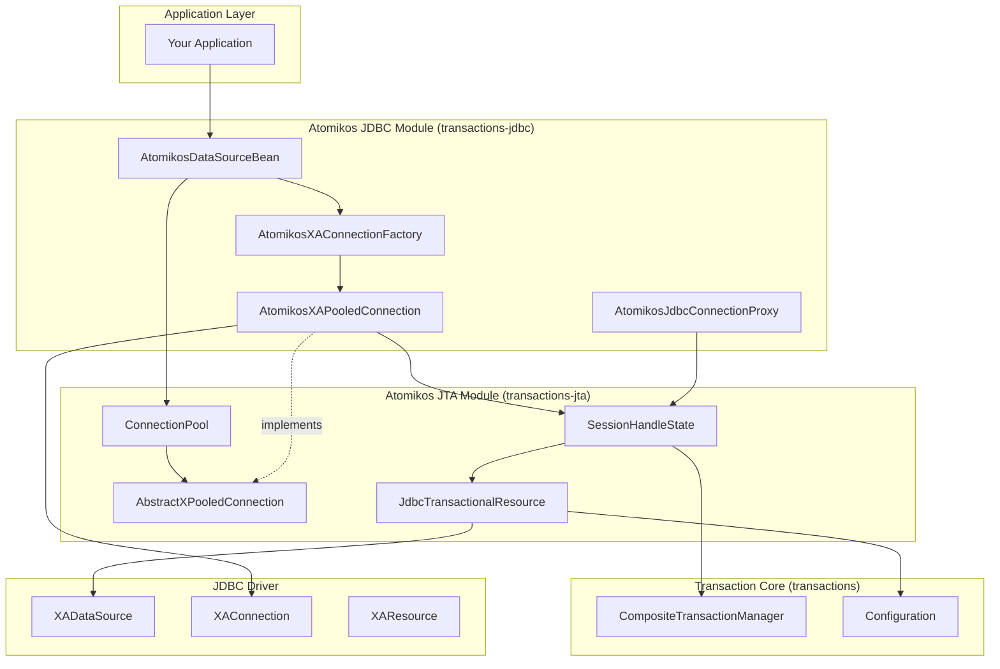

---

## Connection Pooling Components

### 1. Core Pooling Classes (Potentially Reusable)

Located in: `public/transactions-jta/src/main/java/com/atomikos/datasource/pool/`

#### `ConnectionPool<ConnectionType>` (Abstract Base Class)
- **Purpose**: Generic connection pool implementation
- **Key Features**:
  - Min/Max pool size management
  - Connection lifecycle management
  - Maintenance thread for idle connection cleanup
  - Connection validation
  - Timeout handling for borrowing connections
  - Dynamic pool growth
- **Dependencies**: 
  - ✅ Minimal external dependencies
  - ✅ Generic type parameter allows flexibility
  - ⚠️ Uses `XPooledConnection` interface
  - ⚠️ Uses `ConnectionFactory` interface

#### `XPooledConnection<ConnectionType>` (Interface)
- **Purpose**: Wrapper interface for pooled connections
- **Key Responsibilities**:
  - Track connection availability
  - Manage connection proxy creation
  - Handle connection lifecycle events
  - Connection recycling for same thread/transaction
- **Dependencies**: 
  - ✅ Minimal - just an interface
  - ✅ Generic and reusable

#### `AbstractXPooledConnection<ConnectionType>` (Abstract Implementation)
- **Purpose**: Base implementation for pooled connections
- **Key Features**:
  - Connection validation logic
  - Last acquired/released timestamp tracking
  - Test query execution
  - Max lifetime enforcement
- **Dependencies**: 
  - ✅ Mostly self-contained
  - ⚠️ Requires concrete implementation

#### `ConnectionFactory<ConnectionType>` (Interface)
- **Purpose**: Factory for creating pooled connections
- **Dependencies**: 
  - ✅ Simple interface - easy to implement

#### Two Pool Implementations:
1. **`ConnectionPoolWithConcurrentValidation`** - For concurrent access patterns
2. **`ConnectionPoolWithSynchronizedValidation`** - For synchronized access patterns

### 2. JDBC-Specific Implementation (Tightly Coupled)

Located in: `public/transactions-jdbc/src/main/java/com/atomikos/jdbc/`

#### `AtomikosDataSourceBean`
- **Purpose**: Main entry point - implements `javax.sql.DataSource`
- **Key Responsibilities**:
  - DataSource configuration
  - Pool initialization and lifecycle
  - Connection acquisition via `getConnection()`
- **Dependencies**: 
  - ❌ **Tightly coupled to transaction management**
  - ❌ Requires `JdbcTransactionalResource` for recovery
  - ❌ Registers with `Configuration` (transaction service)
  - ❌ Uses `OrderedLifecycleComponent`

#### `AtomikosXAPooledConnection`
- **Purpose**: XA-specific pooled connection implementation
- **Key Features**:
  - Wraps `XAConnection` from JDBC driver
  - Manages connection proxy creation
  - Integrates with transaction system
- **Dependencies**: 
  - ❌ **Requires `SessionHandleState` (transaction-aware)**
  - ❌ Uses `JdbcTransactionalResource`
  - ❌ Interacts with `CompositeTransactionManager`
  - ⚠️ Can work in "localTransactionMode" but still has dependencies

#### `SessionHandleState`
- **Purpose**: Manages transaction context for connections
- **Key Responsibilities**:
  - Tracks transaction branches
  - Manages XAResource enlistment
  - Connection-transaction association
  - Determines when connection can be reused
- **Dependencies**: 
  - ❌ **Core transaction management dependency**
  - ❌ Requires `XATransactionalResource`
  - ❌ Requires `CompositeTransaction`
  - ❌ This is the heart of transaction integration

---

## Connection Pool Workflow

### Basic Pool Operations

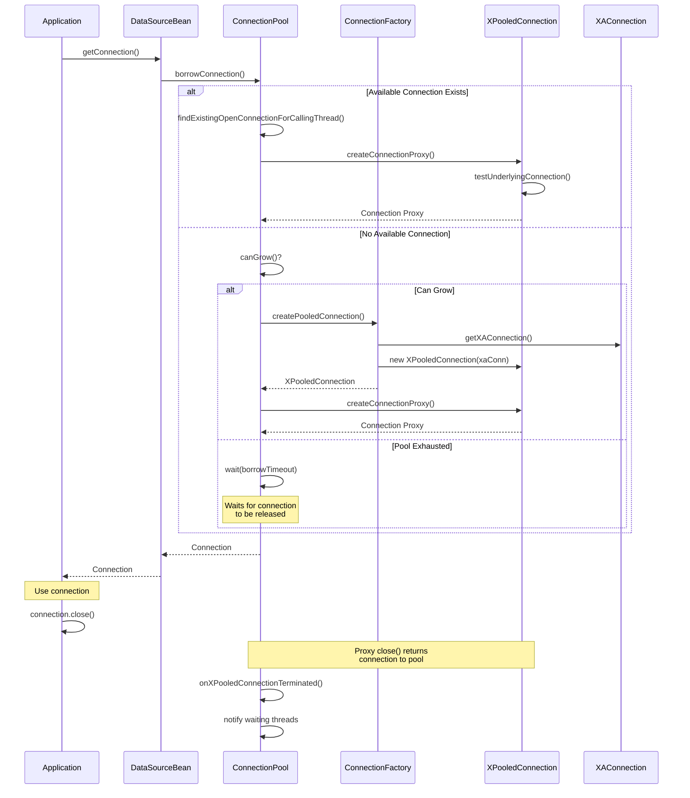

### XA Connection Creation and Transaction Integration

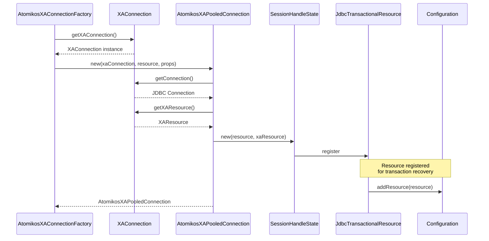

### Connection Usage in Transaction Context

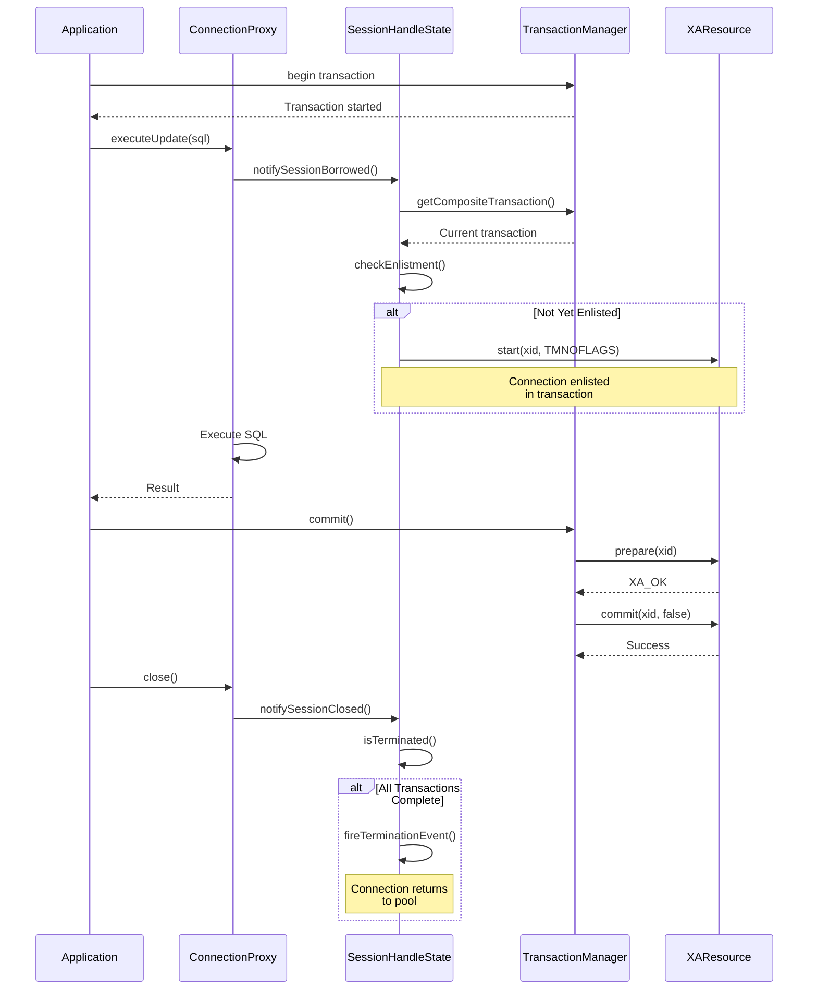

---

## Dependency Analysis

### Module Dependencies

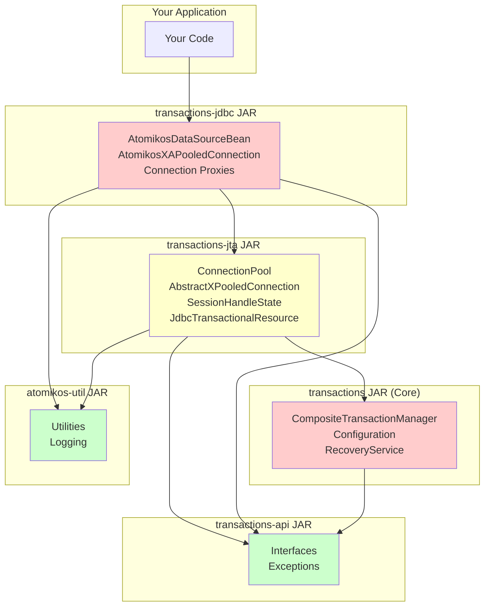

**Legend:**
- 🔴 Red: Tightly coupled to transaction management
- 🟡 Yellow: Partially coupled - some features need transactions
- 🟢 Green: Independent/reusable

### Critical Coupling Points

#### 1. **SessionHandleState** ❌ (Critical Dependency)
Located in: `transactions-jta/src/main/java/com/atomikos/datasource/xa/session/`

**Why it's coupled:**
```java
// From SessionHandleState.java
public class SessionHandleState {
    private XATransactionalResource resource;  // Requires transaction resource
    private TransactionContext currentContext; // Transaction-specific context
    
    public synchronized boolean isInactiveInTransaction(CompositeTransaction tx) {
        // Uses CompositeTransaction from transaction manager
    }
}
```

**Purpose:**
- Manages the state of XA session handles
- Tracks which transactions a connection is involved in
- Determines when a connection can be recycled or returned to pool
- Handles XAResource enlistment

**What it does:**
- Connection recycling within same transaction
- XA branch management
- Transaction context tracking
- Connection-transaction association

#### 2. **JdbcTransactionalResource** ❌ (Critical Dependency)
Located in: `transactions-jta/src/main/java/com/atomikos/datasource/xa/jdbc/`

**Why it's coupled:**
```java
// From AtomikosDataSourceBean.java
JdbcTransactionalResource tr = new JdbcTransactionalResource(
    getUniqueResourceName(), 
    xaDataSource
);
Configuration.addResource(tr); // Registers for recovery
```

**Purpose:**
- XA recovery manager integration
- Transaction coordinator registration
- XAResource lifecycle management

**What it does:**
- Crash recovery after failures
- XAResource connection management for recovery
- Resource registration with transaction service

#### 3. **AtomikosXAPooledConnection** ⚠️ (Partial Dependency)
Located in: `transactions-jdbc/src/main/java/com/atomikos/jdbc/internal/`

**Why it's coupled:**
```java
// From AtomikosXAPooledConnection.java
public AtomikosXAPooledConnection(
    XAConnection xaConnection,
    JdbcTransactionalResource jdbcTransactionalResource,  // Transaction resource
    ConnectionPoolProperties props
) {
    this.sessionHandleState = new SessionHandleState(
        jdbcTransactionalResource, 
        xaConnection.getXAResource()
    );
    this.localTransactionMode = props.getLocalTransactionMode();
}

public boolean canBeRecycledForCallingThread() {
    CompositeTransactionManager tm = Configuration.getCompositeTransactionManager();
    // Uses transaction manager to check if connection can be reused
}
```

**Note:** Has `localTransactionMode` flag but still requires transaction components

#### 4. **Configuration Static Registry** ❌ (Global State)
Located in: `transactions/src/main/java/com/atomikos/icatch/config/`

**Why it's coupled:**
```java
// From AtomikosDataSourceBean.java
Configuration.addResource(tr);        // On init
Configuration.removeResource(name);   // On close
Configuration.getCompositeTransactionManager(); // During operation
```

**Purpose:**
- Global registry for all resources
- Transaction manager singleton
- Recovery coordinator access

---

## Can You Extract Just the Pooling?

### Option 1: Use Complete Atomikos JARs (Recommended)

**Approach:** Import the full Atomikos transaction-essentials JARs

**Required JARs:**
- `transactions-jdbc-6.x.x.jar`
- `transactions-jta-6.x.x.jar`
- `transactions-6.x.x.jar`
- `transactions-api-6.x.x.jar`
- `atomikos-util-6.x.x.jar`

**Maven Dependency:**
```xml
<dependency>
    <groupId>com.atomikos</groupId>
    <artifactId>transactions-jdbc</artifactId>
    <version>6.0.0</version>
</dependency>
```

**Pros:**
- ✅ Works out of the box
- ✅ Fully tested and supported
- ✅ Includes XA connection pooling
- ✅ Transaction recovery capabilities
- ✅ Get bug fixes and updates

**Cons:**
- ❌ Brings in full transaction manager (even if not used)
- ❌ Larger dependency footprint
- ❌ May initialize transaction services even if you don't need them
- ❌ Some overhead from unused features

**Usage Example:**
```java
// Even without using JTA transactions, you can use the pool
AtomikosDataSourceBean dataSource = new AtomikosDataSourceBean();
dataSource.setUniqueResourceName("myDatabase");
dataSource.setXaDataSourceClassName("org.postgresql.xa.PGXADataSource");

Properties props = new Properties();
props.setProperty("serverName", "localhost");
props.setProperty("portNumber", "5432");
props.setProperty("databaseName", "mydb");
props.setProperty("user", "myuser");
props.setProperty("password", "mypassword");
dataSource.setXaProperties(props);

dataSource.setMinPoolSize(5);
dataSource.setMaxPoolSize(20);
dataSource.setTestQuery("SELECT 1");
dataSource.init();

// Get connections - they will be pooled XA connections
Connection conn = dataSource.getConnection();
// Use connection...
conn.close(); // Returns to pool
```

### Option 2: Copy Pooling Classes (Not Recommended)

**Approach:** Extract just the pooling-related classes

**Classes to Copy:**
```
Core Pooling (from transactions-jta):
├── com.atomikos.datasource.pool.ConnectionPool
├── com.atomikos.datasource.pool.ConnectionPoolWithConcurrentValidation
├── com.atomikos.datasource.pool.ConnectionPoolWithSynchronizedValidation
├── com.atomikos.datasource.pool.AbstractXPooledConnection
├── com.atomikos.datasource.pool.XPooledConnection (interface)
├── com.atomikos.datasource.pool.ConnectionFactory (interface)
├── com.atomikos.datasource.pool.ConnectionPoolProperties (interface)
├── com.atomikos.datasource.pool.ConnectionPoolException
└── com.atomikos.datasource.pool.CreateConnectionException

Supporting Classes:
├── com.atomikos.logging.* (logging framework)
├── com.atomikos.thread.* (threading utilities)
├── com.atomikos.timing.* (timer/alarm utilities)
└── Various utility classes
```

**Then Implement Your Own:**
```java
// You'd need to create your own XPooledConnection implementation
public class SimpleXAPooledConnection extends AbstractXPooledConnection<Connection> {
    private XAConnection xaConnection;
    private Connection connection;
    
    public SimpleXAPooledConnection(XAConnection xaConn, ConnectionPoolProperties props) 
        throws SQLException {
        super(props);
        this.xaConnection = xaConn;
        this.connection = xaConn.getConnection();
    }
    
    @Override
    protected Connection doCreateConnectionProxy() {
        // Create a simple proxy without transaction integration
        return new SimpleConnectionProxy(connection, this);
    }
    
    @Override
    protected void testUnderlyingConnection() throws CreateConnectionException {
        // Implement connection validation
        String testQuery = getTestQuery();
        if (testQuery != null) {
            // Execute test query
        }
    }
    
    @Override
    public boolean isAvailable() {
        // Check if connection is available (not currently in use)
        return currentProxy == null || proxyIsClosed;
    }
    
    @Override
    protected void doDestroy() {
        try {
            if (connection != null) connection.close();
            if (xaConnection != null) xaConnection.close();
        } catch (SQLException e) {
            // Log error
        }
    }
    
    @Override
    public boolean canBeRecycledForCallingThread() {
        // Without transaction manager, no recycling
        return false;
    }
}
```

**Estimated Lines of Code:** ~5,000-8,000 LOC to copy and adapt

**Pros:**
- ✅ Minimal dependencies
- ✅ Full control over code
- ✅ No transaction manager overhead

**Cons:**
- ❌ Significant effort (several days of work)
- ❌ Need to maintain and update yourself
- ❌ Risk of bugs in adaptation
- ❌ Lose transaction-aware optimizations (connection recycling)
- ❌ Lose recovery capabilities
- ❌ May violate Atomikos license (check license terms)
- ❌ No community support for your fork

### Option 3: Wrap Standard XA Connection Pool (Alternative)

**Approach:** Use the fact that XAConnection already provides connection pooling semantics

**Simpler Alternative:**
```java
// Standard JDBC XA approach - driver may already pool internally
XADataSource xaDataSource = new PGXADataSource();
// Configure xaDataSource...

// Simple pool wrapper
public class SimpleXAConnectionPool {
    private final BlockingQueue<XAConnection> pool;
    private final XADataSource xaDataSource;
    private final int maxSize;
    
    public SimpleXAConnectionPool(XADataSource xaDataSource, int maxSize) {
        this.xaDataSource = xaDataSource;
        this.maxSize = maxSize;
        this.pool = new ArrayBlockingQueue<>(maxSize);
        // Pre-populate pool
        for (int i = 0; i < maxSize; i++) {
            pool.offer(xaDataSource.getXAConnection());
        }
    }
    
    public XAConnection getXAConnection() throws SQLException {
        XAConnection conn = pool.poll(30, TimeUnit.SECONDS);
        if (conn == null) {
            throw new SQLException("Pool exhausted");
        }
        return new PooledXAConnectionWrapper(conn, this);
    }
    
    void returnConnection(XAConnection conn) {
        pool.offer(conn);
    }
}
```

**Pros:**
- ✅ Very simple (~200 LOC)
- ✅ No external dependencies
- ✅ Easy to understand and maintain

**Cons:**
- ❌ Less sophisticated than Atomikos
- ❌ No connection validation
- ❌ No dynamic sizing
- ❌ No maintenance thread
- ❌ No transaction integration

---

## Key Differences: XA vs Non-XA Pooling

### Non-XA Connection Pooling (e.g., HikariCP)
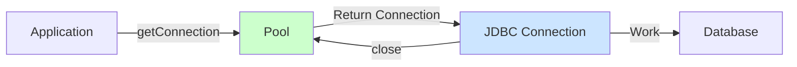

**Characteristics:**
- Simple connection lifecycle
- Connection = database session
- close() returns to pool
- No transaction coordination needed

### XA Connection Pooling (Atomikos)
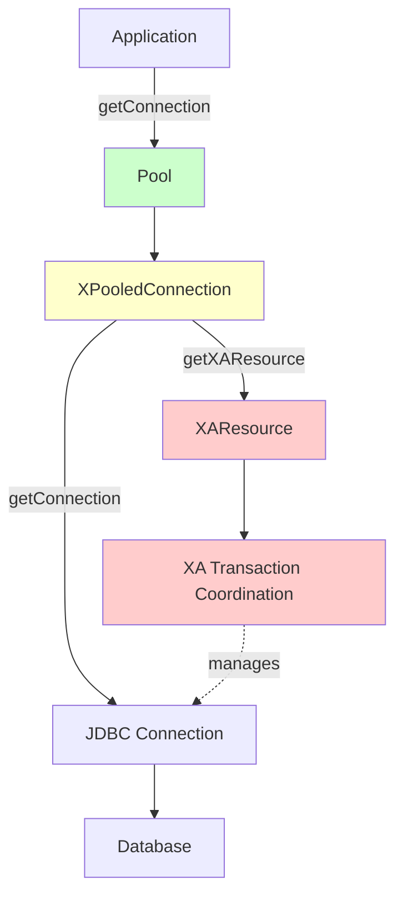

**Characteristics:**
- Two-layer structure: XAConnection + Connection
- XAResource for transaction coordination
- Connection can be associated with multiple transactions
- Transaction manager tracks enlistment
- Connection recycling within transaction

**Why XA Pooling is Different:**
1. **XAConnection Wrapper**: The pool manages `XAConnection` objects, not raw connections
2. **XAResource Management**: Each pooled connection has an associated `XAResource` for 2PC
3. **Transaction Association**: Connections must be properly enlisted/delisted from transactions
4. **Branch Tracking**: Same XAConnection can have multiple transaction branches
5. **Recovery**: Failed transactions need connection to be available for recovery

---

## Atomikos Connection Pool Features

### Features That Work Without Full Transaction Manager

✅ **Basic Pooling:**
- Min/Max pool size
- Connection borrowing with timeout
- Connection validation (test query or JDBC 4 isValid)
- Dynamic pool growth
- Connection lifecycle management

✅ **Maintenance:**
- Idle connection removal
- Max lifetime enforcement
- Periodic maintenance thread
- Pool shrinking to min size

✅ **Robustness:**
- Failed connection detection
- Connection replacement
- Concurrent access handling
- Deadlock prevention

### Features That Require Transaction Manager

❌ **Connection Recycling:**
```java
// This requires CompositeTransactionManager
public boolean canBeRecycledForCallingThread() {
    CompositeTransactionManager tm = Configuration.getCompositeTransactionManager();
    CompositeTransaction current = tm.getCompositeTransaction();
    return sessionHandleState.isInactiveInTransaction(current);
}
```
- Reusing same physical connection for different logical connections in same transaction
- Significant performance optimization for complex transactions
- Reduces connection overhead

❌ **XA Recovery:**
```java
Configuration.addResource(tr); // Registers for crash recovery
```
- After crash, transaction manager needs to query all resources
- Complete pending transactions
- Atomikos provides automatic recovery

❌ **Transaction Context Propagation:**
- Proper XAResource enlistment
- Transaction branch management
- Coordinated commit/rollback

---

## Practical Recommendations

### Scenario 1: You Need XA Transactions
**Recommendation:** Use full Atomikos

**Why:**
- You need the transaction manager anyway
- Connection pooling comes "for free"
- Integrated and tested solution
- Recovery capabilities essential for XA

**Example:**
```java
// Full setup with transaction management
UserTransactionManager utm = new UserTransactionManager();
utm.init();

AtomikosDataSourceBean ds1 = new AtomikosDataSourceBean();
// Configure ds1...
ds1.init();

AtomikosDataSourceBean ds2 = new AtomikosDataSourceBean();
// Configure ds2...
ds2.init();

// Distributed transaction across both databases
utm.begin();
try {
    Connection c1 = ds1.getConnection();
    Connection c2 = ds2.getConnection();
    // Work spanning both databases
    utm.commit();
} catch (Exception e) {
    utm.rollback();
}
```

### Scenario 2: You Only Need XA Connection Pooling (No Distributed Transactions)
**Recommendation:** Consider alternatives or use Atomikos with minimal config

**Option A: Use Atomikos with local transaction mode**
```java
AtomikosDataSourceBean dataSource = new AtomikosDataSourceBean();
dataSource.setLocalTransactionMode(true); // Allows non-JTA usage
// Configure other properties...
dataSource.init();

// Use like any DataSource - no JTA required
Connection conn = dataSource.getConnection();
conn.setAutoCommit(false);
// Do work...
conn.commit();
conn.close();
```

**Option B: Use driver-provided XA pooling**
Many JDBC drivers provide their own XA connection pooling:
```java
// PostgreSQL example
PGXADataSource xaDS = new PGXADataSource();
// Configure...

// Some drivers have built-in pooling
PGConnectionPoolDataSource poolDS = new PGConnectionPoolDataSource();
// This may be sufficient for your needs
```

**Option C: Use HikariCP with XA DataSource**
```java
HikariConfig config = new HikariConfig();
config.setDataSourceClassName("org.postgresql.xa.PGXADataSource");
config.setMaximumPoolSize(20);
// Configure XA properties...
HikariDataSource ds = new HikariDataSource(config);

// Get pooled XA connections
XAConnection xaConn = ((XADataSource) ds).getXAConnection();
```
⚠️ Note: HikariCP primarily pools regular connections, not XAConnections directly

### Scenario 3: You Want to Understand/Modify Pooling Behavior
**Recommendation:** Use Atomikos but study the source

**Advantages:**
- Source code is available (open source)
- Well-documented architecture
- Can extend/customize classes if needed
- Can contribute improvements back

**Classes to Study:**
1. `ConnectionPool` - Core pooling logic
2. `AbstractXPooledConnection` - Connection wrapper behavior
3. `AtomikosXAPooledConnection` - XA-specific handling
4. `SessionHandleState` - Transaction integration

---

## How Atomikos Connection Pooling Works (Detailed)

### Initialization Phase

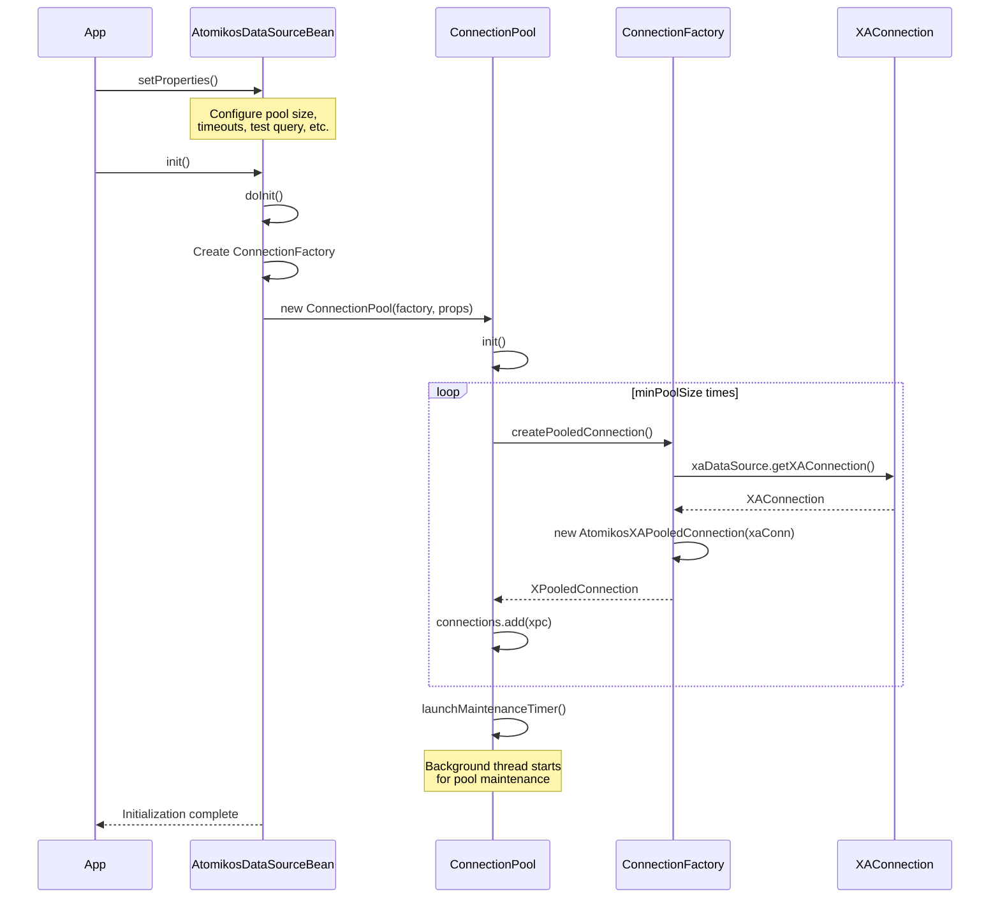

### Connection Borrowing (Happy Path)

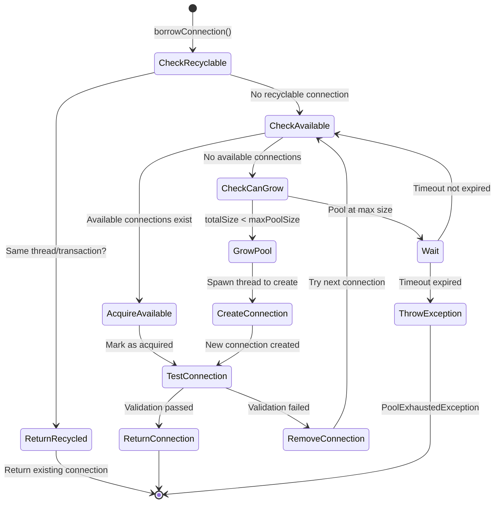

### Maintenance Thread Operations

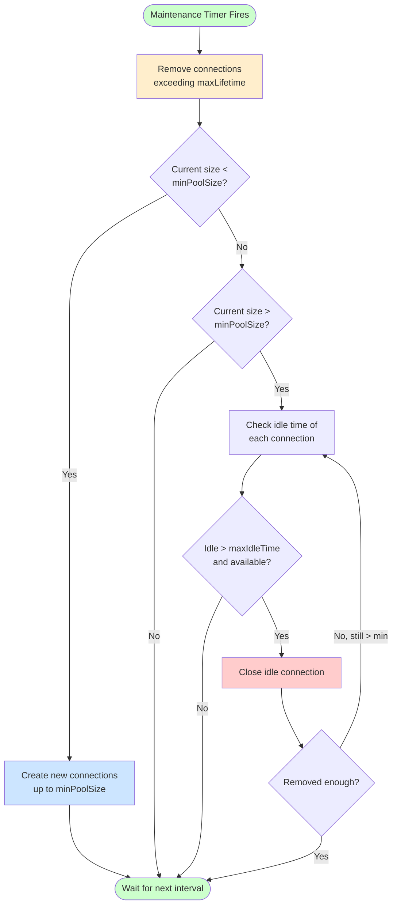

### Connection Return to Pool

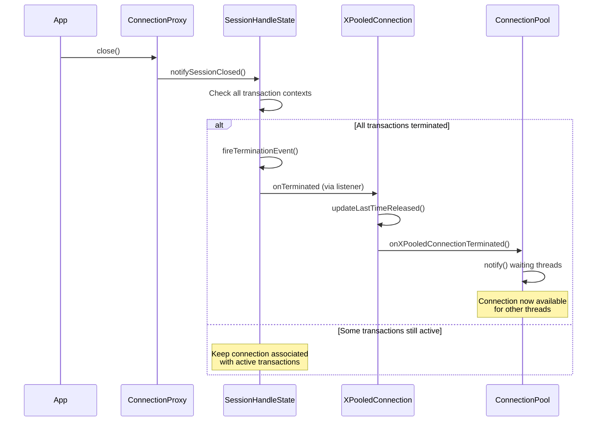

---

## Performance Characteristics

### Pool Overhead

**Per Connection Acquisition:**
- Connection availability check: O(n) where n = pool size
- Connection validation (if testQuery set): 1 DB round-trip
- Proxy object creation: Minimal overhead
- Transaction context check: O(1)

**Optimization - Connection Recycling:**
When enabled (requires transaction manager):
- Same thread requesting connection in same transaction
- Reuses same physical connection
- Avoids validation overhead
- Saves connection creation/destruction

### Memory Footprint

**Per Pooled Connection:**
- XAConnection object: ~1 KB
- JDBC Connection object: ~2 KB
- AtomikosXAPooledConnection wrapper: ~1 KB
- SessionHandleState: ~2 KB
- Total: **~6 KB per connection** (excluding driver internals)

**Pool Overhead:**
- ConnectionPool instance: ~5 KB
- Maintenance timer: ~2 KB
- Total: **~7 KB base + 6 KB per connection**

Example: Pool of 20 connections = 7 + (20 × 6) = **~127 KB**

### Thread Usage

**Maintenance Thread:**
- 1 background thread per pool
- Wakes up every `maintenanceInterval` seconds (default: 60)
- Quick execution (milliseconds per cycle)
- Low CPU usage

**Dynamic Growth Thread:**
- 1 dedicated thread per pool for growing
- Only active when creating new connections
- Allows timeout control on connection creation

---

## Comparison with Other XA Pooling Solutions

### Atomikos vs Bitronix

| Feature | Atomikos | Bitronix |
|---------|----------|----------|
| XA Connection Pooling | ✅ Built-in | ✅ Built-in |
| License | Apache 2.0 / Commercial | LGPL 3.0 |
| Active Development | ✅ Active | ❌ Archived (2016) |
| Spring Boot Support | ✅ Yes | Limited |
| Connection Recycling | ✅ Yes | ✅ Yes |
| Recovery Manager | ✅ Yes | ✅ Yes |
| Pool Standalone Usage | ⚠️ Possible but coupled | ⚠️ Possible but coupled |

### Atomikos vs Narayana

| Feature | Atomikos | Narayana |
|---------|----------|----------|
| XA Connection Pooling | ✅ Built-in | ⚠️ Use external pool |
| License | Apache 2.0 / Commercial | LGPL 2.1 |
| Jakarta EE Support | ✅ Yes | ✅ Yes |
| Standalone Usage | ✅ Yes | ✅ Yes |
| Connection Recycling | ✅ Yes | N/A |
| Recovery Manager | ✅ Yes | ✅ Yes |
| Pool Standalone Usage | ⚠️ Coupled to TM | N/A - no built-in pool |

**Key Insight:** Most XA transaction managers tightly couple pooling with transaction management because:
1. **Efficiency**: Connection recycling optimization requires transaction context
2. **Recovery**: XA recovery needs access to all resource connections
3. **Enlistment**: Proper XAResource management requires coordination
4. **Crash Safety**: Transaction log and resource state must be synchronized

---

## Conclusion

### Summary of Findings

1. **Atomikos Connection Pooling Architecture is Sophisticated**
   - Well-designed with separation of concerns
   - Generic core classes (`ConnectionPool`, `XPooledConnection`)
   - XA-specific extensions properly layered

2. **Transaction Coupling is Significant**
   - `SessionHandleState` requires transaction manager
   - `JdbcTransactionalResource` needed for recovery
   - `Configuration` static registry creates global dependency
   - Connection recycling optimization requires transaction context

3. **Isolation is Technically Possible but Impractical**
   - Would require copying ~5,000-8,000 lines of code
   - Need to stub out transaction manager interfaces
   - Lose key optimizations (connection recycling)
   - Lose XA recovery capabilities
   - Maintenance burden

4. **Better Alternatives Exist**
   - **Option 1**: Use full Atomikos if you need any XA features
   - **Option 2**: Use HikariCP for non-XA pooling (it's excellent)
   - **Option 3**: Use driver-provided XA pooling
   - **Option 4**: Simple custom pool for basic XA needs

### Recommended Approach

**For Your Use Case (Database Proxy with XA Support):**

```java
public class DatabaseProxy {
    private final Map<String, AtomikosDataSourceBean> xaDataSources;
    private final Map<String, HikariDataSource> nonXaDataSources;
    
    public Connection getConnection(String dbName, boolean needsXA) {
        if (needsXA) {
            // Use Atomikos for XA connections
            return xaDataSources.get(dbName).getConnection();
        } else {
            // Use HikariCP for regular connections
            return nonXaDataSources.get(dbName).getConnection();
        }
    }
}
```

**Why This Works:**
- ✅ Best tool for each job
- ✅ HikariCP for non-XA (fastest, most efficient)
- ✅ Atomikos for XA (proper transaction support)
- ✅ Clean separation of concerns
- ✅ No need to extract/copy code
- ✅ Both are well-maintained, production-ready

**Configuration:**
```java
// XA DataSource with Atomikos
AtomikosDataSourceBean xaDS = new AtomikosDataSourceBean();
xaDS.setUniqueResourceName("db1");
xaDS.setXaDataSourceClassName("org.postgresql.xa.PGXADataSource");
// Configure XA properties...
xaDS.setMinPoolSize(5);
xaDS.setMaxPoolSize(20);
xaDS.init();

// Non-XA DataSource with HikariCP
HikariConfig config = new HikariConfig();
config.setJdbcUrl("jdbc:postgresql://localhost/db2");
config.setUsername("user");
config.setPassword("pass");
config.setMaximumPoolSize(20);
HikariDataSource nonXaDS = new HikariDataSource(config);
```

### Final Answer to Original Question

**Can you use only the XA connection pooling of Atomikos in isolation?**

**Technical Answer:** 
Partially - the core pooling classes are relatively independent, but the XA-specific implementation is tightly coupled to the transaction management system.

**Practical Answer:** 
Not recommended. Use the full Atomikos library (it's not that large) or use HikariCP for non-XA and Atomikos for XA separately. Attempting to extract just the pooling would require significant effort and lose important features like connection recycling and XA recovery.

**Best Practice:** 
Import `transactions-jdbc` dependency (~500 KB with dependencies) and use it as designed. The transaction manager will remain dormant if you don't use JTA transactions, so overhead is minimal.

---

## Additional Resources

- **Atomikos Documentation**: https://www.atomikos.com/Documentation/
- **Source Code**: https://github.com/atomikos/transactions-essentials
- **XA Specification**: https://pubs.opengroup.org/onlinepubs/009680699/toc.pdf
- **JDBC 4.x Specification**: https://jcp.org/en/jsr/detail?id=221
- **HikariCP**: https://github.com/brettwooldridge/HikariCP (for comparison)

---

*Document Version: 1.0*  
*Analysis Date: 2026-01-07*  
*Atomikos Version Analyzed: 6.0.1-SNAPSHOT*
